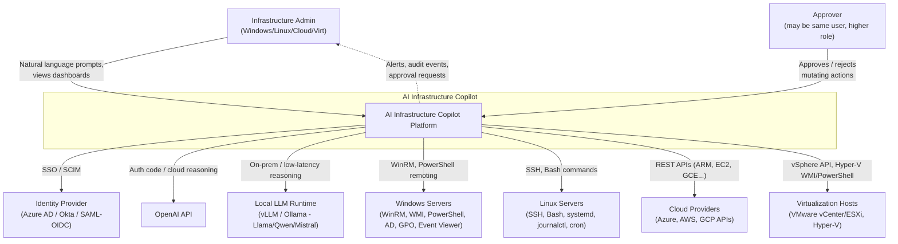
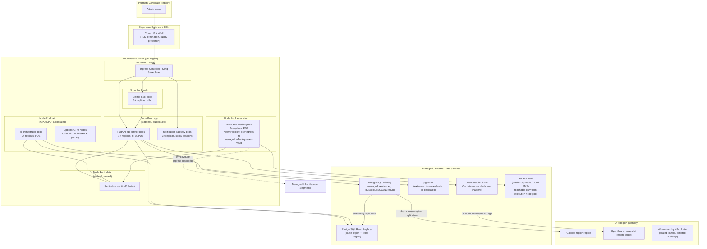
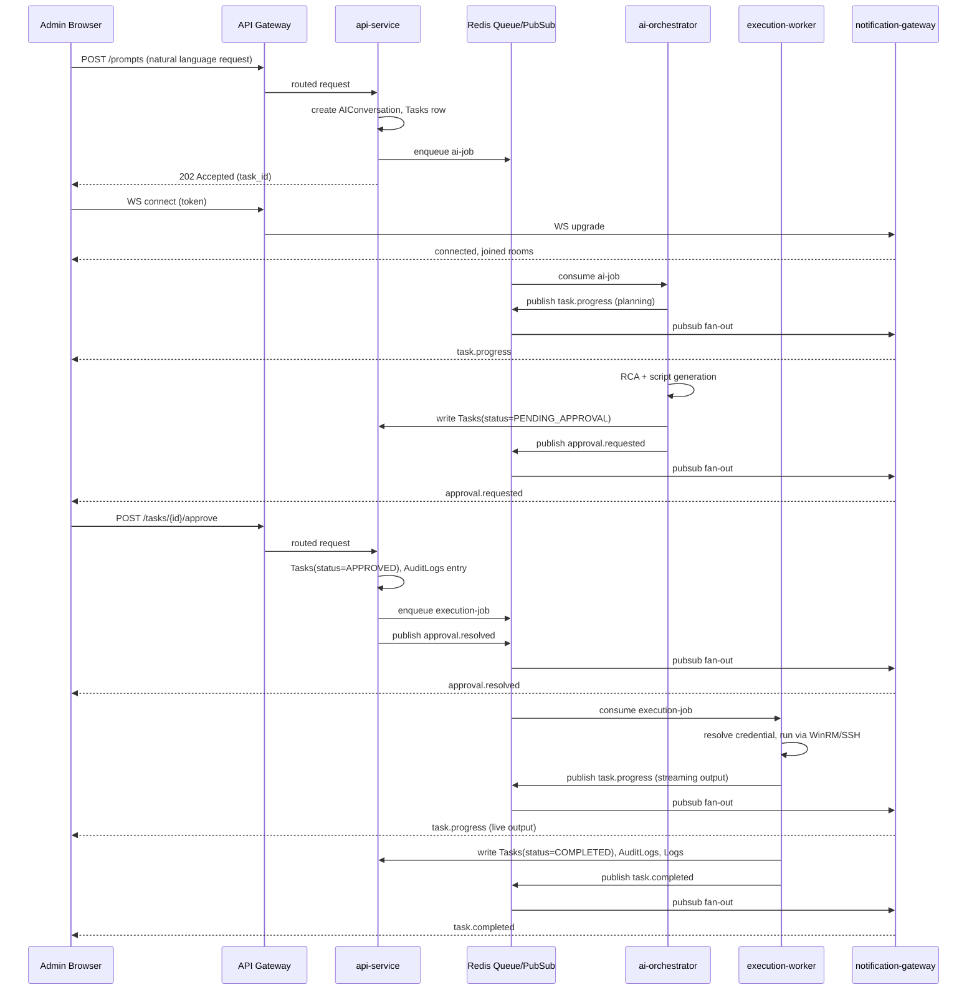

# High-Level Design (HLD)

## 1. Purpose and Scope

This document describes the high-level architecture of AI Infrastructure Copilot: how the major components fit together, how the system is deployed and scaled, how it survives failure, and how real-time updates reach the browser. It is the entry point for engineers who need to understand the system before diving into module-level low-level designs (LLDs). It assumes the fixed tech stack defined in the project brief and does not revisit product requirements.

## 2. Architectural Principles

- **Modular monolith first, isolated services where risk demands it.** The 20 product modules live as routers inside one FastAPI codebase (`apps/api`) to avoid premature microservice sprawl. Execution against real infrastructure (WinRM/SSH) and AI orchestration are pulled into separate deployable services from day one because they have different security, scaling, and latency profiles. See `docs/13-microservice-breakdown.md` for the full rationale.
- **Human approval is a hard gate, not a UI convenience.** Every mutating action (registry edits, service restarts, GPO changes, script execution, VM power operations, cloud resource changes) must pass through an explicit approval step recorded in `AuditLogs` before the execution-worker will run it. Read-only diagnostics (log queries, health checks, `Get-*` cmdlets, `journalctl` reads) may auto-run without approval.
- **Credentials never touch the AI or API tiers.** Vaulted `Credentials` are resolved only inside the execution-worker's isolated network segment, immediately before a WinRM/SSH call. The API and AI orchestration layers only ever see credential *references* (opaque IDs), never secret material.
- **Everything is async and event-driven for long-running work.** Diagnosis, root-cause analysis, and script execution are not synchronous HTTP request/response flows; they are jobs on a Redis-backed queue whose progress is streamed to the browser over Socket.IO.
- **Provider-agnostic AI.** The AI orchestration layer talks to OpenAI API and local LLMs (Llama/Qwen/Mistral via vLLM/Ollama) through one interface so a customer's data-residency or cost requirements can swap providers without touching agent logic.

## 3. System Context

The system context diagram shows AI Infrastructure Copilot as a single system boundary and the humans/external systems around it: admins using the web UI, the managed Windows/Linux servers and devices, cloud provider APIs, virtualization hypervisors, external identity providers, and the LLM providers.

## 4. Container / Component Diagram

The container diagram shows the deployable units inside the platform boundary: the Next.js frontend, an API gateway/ingress, the FastAPI backend (modular monolith), the AI orchestration service, the execution-worker service (network-isolated), the notification gateway, the background job queue, and the data stores.

```mermaid
flowchart TB
    Browser["Admin Browser<br/>Next.js 15 SPA/SSR"]

    subgraph EDGE["Edge / Gateway Tier"]
        GW["API Gateway / Ingress<br/>(Kong or Traefik)<br/>AuthN check, rate limiting, routing, TLS termination"]
    end

    subgraph APP["Application Tier (Kubernetes)"]
        API["apps/api - FastAPI<br/>Modular Monolith<br/>Auth, RBAC, CRUD, module routers"]
        AIORCH["apps/ai-orchestrator<br/>LangGraph + LangChain<br/>Planner/Coordinator/15 agents<br/>MCP tool servers, RAG (pgvector)"]
        EXEC["apps/execution-worker<br/>ISOLATED NETWORK SEGMENT<br/>Holds WinRM/SSH credentials<br/>Only service that touches target infra"]
        NOTIF["notification-gateway<br/>Socket.IO server"]
    end

    subgraph QUEUE["Async Backbone"]
        REDISQ["Redis Streams / Lists<br/>Job Queue (Celery or Arq)"]
        REDISCACHE["Redis<br/>Cache, sessions, pub/sub"]
    end

    subgraph DATA["Data Tier"]
        PG["PostgreSQL<br/>(primary + read replicas)<br/>Core entities"]
        PGV["pgvector<br/>(extension on PostgreSQL,<br/>or dedicated instance)<br/>RAG embeddings"]
        OS["OpenSearch<br/>Logs, events, full-text search,<br/>audit trail search"]
    end

    subgraph TARGETS["Managed Infrastructure (external network zones)"]
        Win["Windows Fleet"]
        Lin["Linux Fleet"]
        CloudAPI["Cloud Provider APIs"]
        VirtHosts["VMware / Hyper-V Hosts"]
    end

    LLM["OpenAI API / Local LLM (vLLM, Ollama)"]

    Browser -->|"HTTPS REST + WebSocket"| GW
    GW -->|"REST"| API
    GW -->|"WebSocket upgrade"| NOTIF
    API -->|"Enqueue AI job"| REDISQ
    API -->|"Read/Write"| PG
    API -->|"Cache reads,<br/>sessions, rate-limit counters"| REDISCACHE
    API -->|"Search queries"| OS
    API -->|"Publish task/alert events"| REDISCACHE

    AIORCH -->|"Consume AI jobs"| REDISQ
    AIORCH -->|"Enqueue execution job<br/>(never executes directly)"| REDISQ
    AIORCH -->|"Vector similarity search"| PGV
    AIORCH -->|"Read context, write AIMessages"| PG
    AIORCH -->|"Prompt/completion"| LLM
    AIORCH -->|"Publish progress events"| REDISCACHE

    EXEC -->|"Consume execution jobs only"| REDISQ
    EXEC -->|"Resolve vaulted credentials<br/>at call time"| PG
    EXEC -->|"WinRM"| Win
    EXEC -->|"SSH"| Lin
    EXEC -->|"Cloud SDK calls"| CloudAPI
    EXEC -->|"vSphere/Hyper-V API"| VirtHosts
    EXEC -->|"Write audit + result events"| PG
    EXEC -->|"Publish execution status"| REDISCACHE

    REDISCACHE -->|"Pub/Sub fan-out"| NOTIF
    NOTIF -->|"WebSocket push:<br/>task progress, alerts,<br/>approval requests"| Browser

    PG -.->|"Log/event ingestion"| OS
```

## 5. Deployment Topology

The platform runs on Kubernetes with distinct node pools so that workloads with different trust levels and scaling characteristics are physically and logically separated.

### 5.1 Node pool rationale

| Node pool | Workloads | Why isolated |
|---|---|---|
| `edge` | Ingress controller | Internet-facing; scaled and patched independently |
| `web` | Next.js SSR | Stateless, CPU-bound, scales on request volume |
| `app` | `api-service`, `notification-gateway` | Stateless, scales on request/connection volume; holds no infra credentials |
| `ai` | `ai-orchestrator`, optional GPU nodes for local LLM | Bursty CPU/GPU load, long-running requests, isolated from execution credentials |
| `execution` | `execution-worker` | Only pool with a `NetworkPolicy` permitting egress to managed infrastructure (WinRM 5985/5986, SSH 22, cloud APIs, vSphere) and to the secrets vault; no other pool has this egress. Tainted + tolerated so only execution-worker pods schedule here |
| `data` | Redis | Stateful, tainted, higher memory nodes |

### 5.2 Multi-region considerations

- **Active/passive by default.** One primary region serves all traffic; a second region holds a warm-standby Kubernetes cluster plus asynchronous PostgreSQL and OpenSearch replicas. Full active/active is not recommended in v1 because execution-worker credential vaults and target-network connectivity (VPNs/ExpressRoute/Direct Connect to customer infrastructure) are typically single-region per tenant.
- **Tenant data residency.** For enterprise customers requiring data residency, the org-to-region mapping is fixed at provisioning time; the API gateway routes by tenant-region binding at the DNS/ingress layer.
- **Local LLM proximity.** If a customer requires on-prem/local LLM inference (vLLM/Ollama) for compliance, those GPU nodes are deployed in the customer's region or on customer-adjacent infrastructure, with the `ai-orchestrator` calling out to that endpoint through the provider-agnostic interface.

## 6. High Availability

| Component | Replica strategy | Notes |
|---|---|---|
| Next.js web pods | 3+ replicas, HPA on CPU/RPS | PodDisruptionBudget `minAvailable: 2` |
| `api-service` (FastAPI) | 3+ replicas, HPA on CPU + queue depth | PDB `minAvailable: 2`; stateless, rolling updates |
| `notification-gateway` (Socket.IO) | 3+ replicas | Socket.IO Redis adapter for cross-pod pub/sub so any pod can serve any client; sticky sessions at ingress as a performance optimization, not a correctness requirement |
| `ai-orchestrator` | 2+ replicas, HPA on queue depth | PDB `minAvailable: 1`; long-running LangGraph runs are checkpointed so a pod restart resumes rather than restarts from scratch |
| `execution-worker` | 2+ replicas per isolated segment (per customer network zone if segmented) | PDB `minAvailable: 1`; jobs are idempotent/at-least-once with dedupe keys so a mid-flight pod restart does not double-execute a mutating action |
| PostgreSQL | 1 primary + 2 read replicas (1 same-zone, 1 cross-zone), automated failover | Managed service (RDS Multi-AZ / Cloud SQL HA / Azure DB HA) preferred over self-managed |
| Redis | Redis Sentinel (3 sentinels) or Redis Cluster, 1 primary + 2 replicas | Queue and cache can tolerate brief unavailability; jobs are durable in Postgres-backed job records as source of truth, Redis is the dispatch mechanism |
| OpenSearch | 3+ data nodes, 3 dedicated master nodes, replica shards = 1 | Index-per-month for logs/events with ILM rollover |
| pgvector | Co-located with PostgreSQL HA (same replica topology) | If scale demands, promote to a dedicated Postgres instance with its own replicas |

General HA rules applied across all deployments:
- Every deployable service has a `PodDisruptionBudget` and `readinessProbe`/`livenessProbe`.
- Anti-affinity rules spread replicas across availability zones.
- Rolling updates with `maxUnavailable: 0` for `api-service` and `execution-worker` to guarantee no capacity dip during deploys.
- Circuit breakers and timeouts at the gateway for calls into `api-service`, and inside `api-service` for calls to `ai-orchestrator` and external LLM providers.

## 7. Disaster Recovery

| Target | RPO | RTO | Strategy |
|---|---|---|---|
| PostgreSQL (core entities, audit logs) | 5 minutes | 30 minutes | Continuous WAL streaming to same-region replica (sync) and cross-region replica (async); automated snapshot every 6 hours retained 30 days; point-in-time recovery via WAL archive retained 7 days |
| pgvector store | 15 minutes | 1 hour | Same backup mechanism as PostgreSQL if co-located; if a dedicated vector store is used, nightly full export plus incremental embedding re-sync from source documents (embeddings are regenerable from `InfrastructureInventory`/`Scripts`/`Reports` source data, which lowers RPO risk) |
| OpenSearch (logs/events) | 1 hour | 2 hours | Automated snapshots to object storage every hour; index templates and ILM policies version-controlled in `infra/` so a fresh cluster can be rebuilt and snapshots restored |
| Redis (cache/queue) | Best-effort, not durable | 5 minutes | Treated as ephemeral; job durability comes from a persisted `Tasks`/`AutomationJobs` row created before enqueue, so a lost queue message is detected by a reconciliation sweep and re-enqueued |
| Kubernetes cluster / manifests | N/A (declarative) | 1 hour to stand up warm-standby cluster | All cluster state is defined in `infra/k8s` (or Helm charts) and `infra/terraform`; DR region cluster is pre-provisioned at minimal scale and scaled up via CI/CD pipeline on failover decision |

**Failover runbook (summary):**
1. Detect primary-region outage via health checks and external monitoring.
2. Promote cross-region PostgreSQL replica to primary; update connection secrets.
3. Restore latest OpenSearch snapshot into DR cluster (or promote a continuously-synced DR OpenSearch cluster if budget allows).
4. Scale up DR Kubernetes node pools via Terraform/CI pipeline; deploy last-known-good image tags.
5. Re-point DNS/ingress to DR region.
6. `execution-worker` pods in DR region only come up once connectivity to the customer's target infrastructure network (VPN/peering) is confirmed re-established, since a false-start execution worker with stale network state is a correctness risk, not just an availability one.
7. Post-failover: reconcile any `Tasks`/`AutomationJobs` left in `RUNNING` state by marking them `UNKNOWN` and surfacing them to admins for manual review rather than silently retrying mutating actions.

Backups are tested via quarterly restore drills into an isolated namespace; drill results are logged in `AuditLogs` equivalents for the ops team (a `DR_DRILL` report type under `Reports`).

## 8. Caching Strategy (Redis)

Redis serves three distinct purposes, deliberately separated logically (either separate Redis logical DBs or separate key prefixes/namespaces) so cache eviction never touches queue data:

1. **Application cache** (`cache:*`)
   - Read-through cache for `InfrastructureInventory`, `Servers`, `Devices` list views and dashboard aggregates (Server Health Dashboard, Alert Center summaries).
   - TTL-based (30 to 300 seconds depending on volatility) rather than write-through, since a slightly stale inventory view is acceptable but stale credentials or approval state is not (those are never cached).
   - Cache-aside pattern from `api-service`: check Redis, on miss query PostgreSQL/OpenSearch, populate Redis with TTL.
2. **Session / rate-limit state** (`session:*`, `ratelimit:*`)
   - JWT refresh-token allowlist/denylist for fast revocation checks.
   - Sliding-window rate-limit counters per API key/user/org, read by the API gateway and by `api-service` for AI-endpoint-specific quotas (LLM calls are expensive; rate limits protect cost as well as availability).
3. **Pub/Sub + job queue backbone** (`queue:*`, channel `events:*`)
   - Celery or Arq broker for `ai-orchestrator` jobs and `execution-worker` jobs.
   - Pub/Sub channels that `notification-gateway` subscribes to for fan-out of task progress, alert, and approval-request events (see Section 9).
   - Socket.IO's own Redis adapter for cross-pod broadcast, kept in its own namespace to avoid key collisions with the job queue.

Cache invalidation rule: any write to `Servers`, `Devices`, `InfrastructureInventory`, `Alerts`, or `Policies` in `api-service` publishes an invalidation message on `events:cache-invalidate` immediately after the DB transaction commits, so all `api-service` pods drop the relevant cache keys rather than waiting for TTL expiry.

## 9. Background Workers and Job Queue Design

Two distinct queues exist on the same Redis-backed broker, consumed by two different services, because they have different security and latency requirements:

- **`ai-jobs` queue** consumed by `ai-orchestrator`
  - Producer: `api-service` (on user prompt submission via AI Chat, or on any module's "Ask AI" / auto-diagnosis trigger).
  - Payload: `AIConversation` id, prompt, module context, requesting user, org.
  - Consumer runs the LangGraph pipeline: Planner → Agent Selection → Tool Calling (via MCP) → Data Collection → Reasoning → Root Cause Analysis → Recommendation → Script Generation.
  - If the plan concludes a mutating action is needed, `ai-orchestrator` writes a `Tasks` row with status `PENDING_APPROVAL` and stops; it never enqueues to `execution-jobs` until an approval record exists.
- **`execution-jobs` queue** consumed only by `execution-worker`
  - Producer: `api-service` (after a human clicks Approve, which flips the `Tasks` row to `APPROVED` inside a DB transaction) or `ai-orchestrator` directly for pre-approved read-only diagnostics.
  - Payload: `Tasks`/`AutomationJobs` id, target `Servers`/`Devices` id, `Credentials` reference (opaque id, not secret), script/command reference from `Scripts` or `Script Library`.
  - Consumer resolves the credential from the vault at call time, opens the WinRM/SSH/cloud-SDK/vSphere session, executes, streams output, writes results back to `Tasks`/`Logs`/`AuditLogs`, and publishes progress events.
- **Recurring/scheduled work** (cron-style) for `Automation Workflows`, scheduled `Reports`, and policy compliance sweeps uses a scheduler (Celery beat or Arq's cron support) running as a singleton (leader-elected) deployment that enqueues onto the same two queues rather than executing anything itself.
- **Retry policy:** read-only jobs retry automatically (exponential backoff, max 3 attempts). Mutating execution jobs never auto-retry; a failed mutating action surfaces to the admin as a failed `Tasks` entry requiring a fresh human decision, to avoid silently repeating a failed infrastructure change.
- **Idempotency:** every job carries a deterministic idempotency key (`task_id` + `attempt`) so at-least-once delivery from Redis cannot cause duplicate execution; `execution-worker` checks `Tasks.status` transactionally before running.
- **Dead-letter handling:** jobs that exhaust retries or fail to deserialize move to a `*-dlq` list, alertable via `Alert Center`, inspectable by ops.

## 10. WebSocket Notification Flow (Socket.IO)

`notification-gateway` is a dedicated Socket.IO service (separate from `api-service`) so that long-lived WebSocket connections do not consume the same pod capacity or affect the deploy cadence of the stateless REST API.

**Connection lifecycle:**
1. Browser authenticates via the normal HTTPS/REST session, receives a short-lived WebSocket auth token from `api-service`.
2. Browser opens a Socket.IO connection to `notification-gateway` through the API gateway (WebSocket upgrade), presenting the token.
3. `notification-gateway` validates the token, joins the socket to rooms scoped to `org:{org_id}`, `user:{user_id}`, and any module/resource rooms the user is currently viewing (e.g. `server:{server_id}`).

**Event types pushed to the UI:**

| Event | Room scope | Triggered by | Consumed by (module) |
|---|---|---|---|
| `task.progress` | `org`, `task:{task_id}` | `ai-orchestrator` and `execution-worker` publishing intermediate steps | AI Chat, Automation Workflows, Script Library run view |
| `task.completed` / `task.failed` | `org`, `task:{task_id}` | `execution-worker` on job completion | AI Chat, Automation Workflows |
| `approval.requested` | `org`, `role:approver` | `ai-orchestrator` writing a `PENDING_APPROVAL` task | Alert Center, AI Chat, in-app notification bell |
| `approval.resolved` | `task:{task_id}`, requesting `user` | `api-service` on approve/reject action | AI Chat, Automation Workflows |
| `alert.created` / `alert.updated` | `org`, `severity:{level}` | Monitoring ingestion into `Alerts` (Alert Center, Security Center, Server Health Dashboard) | Alert Center, Server Health Dashboard, Security Center |
| `inventory.changed` | `org` | `Infrastructure Inventory` sync jobs | Infrastructure Inventory, Server Health Dashboard |
| `audit.appended` | `org`, `role:admin` | Any service writing to `AuditLogs` | Security Center, audit viewer |

**Flow diagram:**

## 11. API Gateway Responsibilities

The API gateway (Kong or Traefik, chosen at build time; both satisfy the requirements below) sits in front of every HTTP and WebSocket entrypoint and is responsible for:

- **TLS termination** for all inbound traffic; internal traffic between gateway and services uses mTLS or a service mesh (optional, e.g. Linkerd) inside the cluster.
- **AuthN check (coarse-grained):** validates the JWT signature/expiry issued by `api-service`'s Authentication module before forwarding; rejects malformed/expired tokens at the edge so invalid traffic never reaches application pods. Fine-grained RBAC/permission checks (per `Roles`/`Permissions`) remain in `api-service`.
- **Rate limiting:** per-API-key and per-org quotas, with a stricter tier for AI-invoking endpoints (`/ai/*`, `/prompts`) to bound LLM spend, enforced via Redis-backed counters shared with `api-service`.
- **Routing:** path-based routing to `web` (Next.js), `api-service` (`/api/*`), `notification-gateway` (`/socket.io/*`), keeping `ai-orchestrator` and `execution-worker` unreachable from outside the cluster entirely (they have no ingress route, only internal service DNS reachable from `api-service`/queue).
- **Request/response transformation:** header injection (request-id/trace-id for observability), CORS policy enforcement, request size limits (important for script upload endpoints in Script Library).
- **Observability:** structured access logs and metrics (latency, status code, upstream) exported to the same OpenSearch/observability stack used for application logs.
- **Canary/blue-green routing:** weighted routing support for progressive rollout of `api-service` and `web` deployments.

## 12. Cross-References

- Service boundaries and inter-service communication rationale: `docs/13-microservice-breakdown.md`.
- Concrete repository layout for every component named above: `docs/11-folder-structure.md`.
