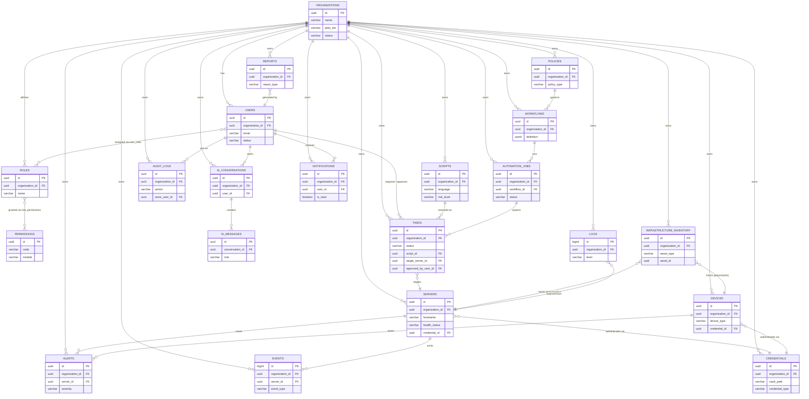

# 04. Database Design

## 1. Overview

AI Infrastructure Copilot is a multi-tenant SaaS platform. The primary data store is **PostgreSQL 15+**, supplemented by:

- **Redis** for session cache, job queues, rate limiting, and ephemeral state (e.g. active WebSocket/Socket.IO room membership, streaming AI response buffers).
- **OpenSearch** for full-text search and log/event exploration at scale (Windows Event Log Analyzer, Logs, AuditLogs search UI). OpenSearch indices are derived/synced from PostgreSQL tables; Postgres remains the system of record.
- **pgvector** (as a Postgres extension) for storing embeddings used in retrieval-augmented generation (RCA knowledge base, script library semantic search, documentation search for the AI Chat module).

Required Postgres extensions: `pgcrypto` (UUID generation, hashing), `pgvector` (embeddings), `pg_partman` or native declarative partitioning (high-volume tables).

### Conventions used throughout this document

- All primary keys are `UUID` generated with `gen_random_uuid()`, except high-volume time-series/append-only tables (`performance_metrics`, `event_log_entries`, `logs`) which use `BIGINT GENERATED ALWAYS AS IDENTITY` for cheaper storage and index performance, paired with a `UUID` external reference id where cross-service correlation is needed.
- Every table has `created_at TIMESTAMPTZ NOT NULL DEFAULT now()`. Mutable tables also have `updated_at TIMESTAMPTZ NOT NULL DEFAULT now()`, maintained by a shared `set_updated_at()` trigger.
- Foreign keys default to `ON DELETE RESTRICT` unless otherwise noted; child rows that should disappear with a parent (e.g. join tables, message rows) use `ON DELETE CASCADE`.
- JSON-shaped, sparse, or provider-specific attributes are stored in `JSONB` columns rather than modeled as new tables, to keep the schema stable while module coverage grows.

## 2. Multi-Tenancy

Every table in the system, with three deliberate exceptions, carries a mandatory `organization_id UUID NOT NULL REFERENCES organizations(id)` column:

- **Organizations** itself is the tenant root and has no `organization_id`.
- **Permissions** is a global, platform-defined catalog (e.g. `servers.read`, `scripts.execute`, `tasks.approve`) shared by all tenants, so it has no `organization_id`. Role-to-permission grants are tenant-scoped through `role_permissions` (via `roles.organization_id`).
- Pure join tables that hang off an already-scoped parent (e.g. `role_permissions`, `user_roles`, `ad_group_memberships`) do not duplicate `organization_id`, but every query path is required to join through the scoped parent.

Enforcement is layered, not left to convention alone:

1. **Application layer**: the FastAPI dependency layer injects `organization_id` from the authenticated JWT into every repository call; no query is allowed to omit it.
2. **Database layer**: Postgres **Row-Level Security (RLS)** is enabled on every tenant-scoped table with a policy such as:

```sql
ALTER TABLE servers ENABLE ROW LEVEL SECURITY;

CREATE POLICY tenant_isolation ON servers
    USING (organization_id = current_setting('app.current_org_id')::uuid);
```

The backend sets `app.current_org_id` via `SET LOCAL` at the start of every request-scoped transaction. This is the safety net that prevents a bug in application code from leaking cross-tenant data.

3. **Indexing**: every tenant-scoped table has `organization_id` as the leading column of its primary lookup index, since virtually all queries are tenant-filtered first (e.g. `(organization_id, hostname)`, `(organization_id, status, created_at)`).

## 3. Soft-Delete vs Hard-Delete Policy

| Category | Policy | Tables |
|---|---|---|
| **Soft delete** (`deleted_at TIMESTAMPTZ NULL`, filtered via a default `WHERE deleted_at IS NULL` in the ORM/query layer) | Used for anything that is user-managed, referenced by history, or needed for audit/compliance reconstruction even after removal. | `organizations`, `users`, `roles`, `servers`, `devices`, `credentials`, `scripts`, `workflows`, `policies`, `cloud_accounts`, `script_library_collections` |
| **Hard delete** (row physically removed, optionally after a retention window) | Used for transient, high-volume, or purely operational data with no long-term compliance value once superseded. | `notifications` (deleted after read + N days), `performance_metrics` (dropped via partition rotation after retention window), `dhcp_leases` (expired leases purged), cached module tables (`ad_users`, `ad_groups`, `dns_records`, `iis_sites`, etc. - these are re-synced from source of truth on each discovery run, so stale rows are hard-deleted and re-inserted rather than soft-deleted) |
| **Append-only / never deleted** | Compliance-critical, immutable records. No `UPDATE` or `DELETE` is permitted at the application layer; only `INSERT`. Enforced with a `REVOKE UPDATE, DELETE` grant and, optionally, a `BEFORE UPDATE OR DELETE` trigger that raises an exception. | `audit_logs`, `events` (rotated out only by partition drop after the retention period expires, never edited) |

Rule of thumb: if a row's disappearance could ever need to be explained to an auditor or a customer ("why did my server disappear from the dashboard"), it is soft-deleted. If it is a rolling cache or metric stream, it is hard-deleted/partition-rotated.

## 4. Credential Storage (Vaulting)

Credentials used to connect to managed infrastructure (WinRM, SSH, cloud IAM keys, API tokens) are **never stored as plaintext in PostgreSQL**, and are never stored as reversibly-encrypted blobs directly usable by the application without a secrets-manager round trip. The design uses **HashiCorp Vault** (or an equivalent KMS-backed secrets engine) as the actual secret store:

- The `credentials` table stores only:
  - `vault_engine` (e.g. `hashicorp_vault`)
  - `vault_path` (e.g. `secret/data/org/{organization_id}/credential/{credential_id}`) - a *pointer*, not a secret.
  - `vault_key_version` for rotation tracking.
  - `encrypted_metadata JSONB` - non-secret, envelope-encrypted (AES-256-GCM, application-managed data key sourced from Vault Transit) hints such as username, credential type, and target scope, used for display purposes ("connect as svc-winrm-prod") without ever exposing the secret itself.
- The actual secret material (password, private key, API key) is written to Vault by the backend at creation time and is fetched by the execution engine, just-in-time, immediately before a WinRM/SSH connection is opened, then discarded from process memory.
- `credentials` rows are soft-deleted; the corresponding Vault path is revoked, not merely orphaned.
- All reads/writes of `vault_path` are captured in `audit_logs` (`action = credential.accessed`), independent of whether the underlying secret fetch succeeded.

This means a full dump of the PostgreSQL database contains zero usable secrets: an attacker would still need Vault access (separately authenticated, with its own audit trail) to do anything with a `vault_path`.

## 5. Core Entity Schema

### 5.1 organizations

Tenant root. Not itself scoped by `organization_id`.

```sql
CREATE TABLE organizations (
    id              UUID PRIMARY KEY DEFAULT gen_random_uuid(),
    name            VARCHAR(255) NOT NULL,
    slug            VARCHAR(100) NOT NULL UNIQUE,
    plan_tier       VARCHAR(50)  NOT NULL DEFAULT 'starter', -- starter | professional | enterprise
    status          VARCHAR(20)  NOT NULL DEFAULT 'trial',   -- trial | active | suspended | cancelled
    settings        JSONB        NOT NULL DEFAULT '{}',      -- feature flags, branding, approval thresholds
    created_at      TIMESTAMPTZ  NOT NULL DEFAULT now(),
    updated_at      TIMESTAMPTZ  NOT NULL DEFAULT now(),
    deleted_at      TIMESTAMPTZ
);
CREATE UNIQUE INDEX idx_organizations_slug ON organizations (slug) WHERE deleted_at IS NULL;
```

### 5.2 users

```sql
CREATE TABLE users (
    id               UUID PRIMARY KEY DEFAULT gen_random_uuid(),
    organization_id  UUID NOT NULL REFERENCES organizations(id),
    email            VARCHAR(320) NOT NULL,
    password_hash    VARCHAR(255) NOT NULL, -- argon2id
    full_name        VARCHAR(255) NOT NULL,
    status           VARCHAR(20)  NOT NULL DEFAULT 'invited', -- invited | active | disabled
    mfa_enabled      BOOLEAN      NOT NULL DEFAULT false,
    mfa_secret_ref   VARCHAR(255),           -- vault_path to TOTP seed, never plaintext
    last_login_at    TIMESTAMPTZ,
    created_at       TIMESTAMPTZ NOT NULL DEFAULT now(),
    updated_at       TIMESTAMPTZ NOT NULL DEFAULT now(),
    deleted_at       TIMESTAMPTZ
);
CREATE UNIQUE INDEX idx_users_org_email ON users (organization_id, lower(email)) WHERE deleted_at IS NULL;
CREATE INDEX idx_users_org_status ON users (organization_id, status);
```

### 5.3 roles

```sql
CREATE TABLE roles (
    id               UUID PRIMARY KEY DEFAULT gen_random_uuid(),
    organization_id  UUID NOT NULL REFERENCES organizations(id),
    name             VARCHAR(100) NOT NULL,           -- Admin, Server Operator, Auditor, Read-Only
    description      TEXT,
    is_system_role   BOOLEAN NOT NULL DEFAULT false,  -- seeded, non-editable roles
    created_at       TIMESTAMPTZ NOT NULL DEFAULT now(),
    updated_at       TIMESTAMPTZ NOT NULL DEFAULT now(),
    deleted_at       TIMESTAMPTZ
);
CREATE UNIQUE INDEX idx_roles_org_name ON roles (organization_id, name) WHERE deleted_at IS NULL;
```

### 5.4 permissions

Global catalog, no tenant scope.

```sql
CREATE TABLE permissions (
    id           UUID PRIMARY KEY DEFAULT gen_random_uuid(),
    code         VARCHAR(150) NOT NULL UNIQUE,   -- servers.read, scripts.execute, tasks.approve
    module       VARCHAR(100) NOT NULL,          -- maps to the 20 product modules
    description  TEXT
);
```

### 5.5 role_permissions / user_roles (join tables)

```sql
CREATE TABLE role_permissions (
    role_id        UUID NOT NULL REFERENCES roles(id) ON DELETE CASCADE,
    permission_id  UUID NOT NULL REFERENCES permissions(id) ON DELETE CASCADE,
    created_at     TIMESTAMPTZ NOT NULL DEFAULT now(),
    PRIMARY KEY (role_id, permission_id)
);

CREATE TABLE user_roles (
    user_id     UUID NOT NULL REFERENCES users(id) ON DELETE CASCADE,
    role_id     UUID NOT NULL REFERENCES roles(id) ON DELETE CASCADE,
    granted_at  TIMESTAMPTZ NOT NULL DEFAULT now(),
    granted_by  UUID REFERENCES users(id),
    PRIMARY KEY (user_id, role_id)
);
```

### 5.6 servers

Core managed-host record. Carries **intentionally denormalized** health fields (see Section 9).

```sql
CREATE TABLE servers (
    id                 UUID PRIMARY KEY DEFAULT gen_random_uuid(),
    organization_id    UUID NOT NULL REFERENCES organizations(id),
    hostname           VARCHAR(255) NOT NULL,
    ip_address         INET,
    os_type            VARCHAR(20)  NOT NULL,        -- windows | linux
    os_version         VARCHAR(100),
    environment        VARCHAR(30)  NOT NULL DEFAULT 'production', -- production | staging | development
    credential_id      UUID REFERENCES credentials(id),
    -- Denormalized dashboard columns, refreshed by monitoring pipeline / health_snapshots consumer
    health_status      VARCHAR(20)  NOT NULL DEFAULT 'unknown', -- healthy | warning | critical | unknown
    cpu_usage_pct      NUMERIC(5,2),
    memory_usage_pct   NUMERIC(5,2),
    disk_usage_pct     NUMERIC(5,2),
    open_alerts_count  INTEGER      NOT NULL DEFAULT 0,
    last_seen_at       TIMESTAMPTZ,
    tags               JSONB        NOT NULL DEFAULT '{}',
    created_at         TIMESTAMPTZ NOT NULL DEFAULT now(),
    updated_at         TIMESTAMPTZ NOT NULL DEFAULT now(),
    deleted_at         TIMESTAMPTZ
);
CREATE UNIQUE INDEX idx_servers_org_hostname ON servers (organization_id, hostname) WHERE deleted_at IS NULL;
CREATE INDEX idx_servers_org_health ON servers (organization_id, health_status) WHERE deleted_at IS NULL;
CREATE INDEX idx_servers_org_env ON servers (organization_id, environment);
```

### 5.7 devices

Non-server managed assets (network switches, firewalls, printers, IoT).

```sql
CREATE TABLE devices (
    id               UUID PRIMARY KEY DEFAULT gen_random_uuid(),
    organization_id  UUID NOT NULL REFERENCES organizations(id),
    device_type      VARCHAR(50)  NOT NULL, -- network_switch | firewall | router | printer | iot
    name             VARCHAR(255) NOT NULL,
    ip_address       INET,
    mac_address      MACADDR,
    vendor           VARCHAR(100),
    model            VARCHAR(100),
    credential_id    UUID REFERENCES credentials(id),
    status           VARCHAR(20)  NOT NULL DEFAULT 'unknown',
    last_seen_at     TIMESTAMPTZ,
    created_at       TIMESTAMPTZ NOT NULL DEFAULT now(),
    updated_at       TIMESTAMPTZ NOT NULL DEFAULT now(),
    deleted_at       TIMESTAMPTZ
);
CREATE INDEX idx_devices_org_type ON devices (organization_id, device_type) WHERE deleted_at IS NULL;
```

### 5.8 credentials

See Section 4 for the vaulting rationale.

```sql
CREATE TABLE credentials (
    id                  UUID PRIMARY KEY DEFAULT gen_random_uuid(),
    organization_id     UUID NOT NULL REFERENCES organizations(id),
    name                VARCHAR(255) NOT NULL,
    credential_type     VARCHAR(30)  NOT NULL, -- winrm | ssh_password | ssh_key | api_key | cloud_iam
    vault_engine        VARCHAR(30)  NOT NULL DEFAULT 'hashicorp_vault',
    vault_path          VARCHAR(500) NOT NULL, -- secret/data/org/{organization_id}/credential/{id}
    vault_key_version   INTEGER      NOT NULL DEFAULT 1,
    encrypted_metadata  JSONB        NOT NULL DEFAULT '{}', -- envelope-encrypted display hints only
    rotation_policy     VARCHAR(30)  DEFAULT 'manual',      -- manual | 30d | 90d
    last_rotated_at     TIMESTAMPTZ,
    created_by_user_id  UUID REFERENCES users(id),
    created_at          TIMESTAMPTZ NOT NULL DEFAULT now(),
    updated_at          TIMESTAMPTZ NOT NULL DEFAULT now(),
    deleted_at          TIMESTAMPTZ
);
CREATE INDEX idx_credentials_org ON credentials (organization_id) WHERE deleted_at IS NULL;
CREATE UNIQUE INDEX idx_credentials_vault_path ON credentials (vault_path);
```

No column in this table ever holds a usable secret; `encrypted_metadata` is envelope-encrypted at rest and is display-only.

### 5.9 scripts

```sql
CREATE TABLE scripts (
    id                   UUID PRIMARY KEY DEFAULT gen_random_uuid(),
    organization_id      UUID NOT NULL REFERENCES organizations(id),
    name                 VARCHAR(255) NOT NULL,
    language             VARCHAR(20)  NOT NULL, -- powershell | bash | python
    category             VARCHAR(100),
    content              TEXT         NOT NULL,
    content_embedding    VECTOR(1536),           -- pgvector, for semantic search in Script Library / RAG
    version              INTEGER      NOT NULL DEFAULT 1,
    risk_level           VARCHAR(20)  NOT NULL DEFAULT 'medium', -- low | medium | high
    is_ai_generated      BOOLEAN      NOT NULL DEFAULT false,
    is_approved_template BOOLEAN      NOT NULL DEFAULT false,
    created_by_user_id   UUID REFERENCES users(id),
    created_at           TIMESTAMPTZ NOT NULL DEFAULT now(),
    updated_at           TIMESTAMPTZ NOT NULL DEFAULT now(),
    deleted_at           TIMESTAMPTZ
);
CREATE INDEX idx_scripts_org_lang ON scripts (organization_id, language) WHERE deleted_at IS NULL;
CREATE INDEX idx_scripts_embedding ON scripts USING hnsw (content_embedding vector_cosine_ops);
```

`script_versions` (append-only history, referenced when a script is edited):

```sql
CREATE TABLE script_versions (
    id           UUID PRIMARY KEY DEFAULT gen_random_uuid(),
    script_id    UUID NOT NULL REFERENCES scripts(id) ON DELETE CASCADE,
    version      INTEGER NOT NULL,
    content      TEXT NOT NULL,
    changed_by_user_id UUID REFERENCES users(id),
    created_at   TIMESTAMPTZ NOT NULL DEFAULT now(),
    UNIQUE (script_id, version)
);
```

### 5.10 tasks

The central **Human Approval gate** record. Every mutating action (script execution, workflow step, remediation) produces a task.

```sql
CREATE TABLE tasks (
    id                    UUID PRIMARY KEY DEFAULT gen_random_uuid(),
    organization_id       UUID NOT NULL REFERENCES organizations(id),
    type                  VARCHAR(30) NOT NULL, -- script_execution | workflow_step | remediation
    status                VARCHAR(30) NOT NULL DEFAULT 'pending_approval',
        -- pending_approval | approved | rejected | running | completed | failed | cancelled
    target_server_id      UUID REFERENCES servers(id),
    target_device_id      UUID REFERENCES devices(id),
    script_id             UUID REFERENCES scripts(id),
    automation_job_id      UUID REFERENCES automation_jobs(id),
    execution_method      VARCHAR(10),          -- winrm | ssh
    payload               JSONB NOT NULL DEFAULT '{}',  -- script params, target scope
    result                JSONB,                -- stdout/stderr, exit code, structured output
    requires_approval     BOOLEAN NOT NULL DEFAULT true, -- false only for read-only diagnostics
    requested_by_user_id  UUID REFERENCES users(id),
    requested_by_ai       BOOLEAN NOT NULL DEFAULT false,
    approved_by_user_id   UUID REFERENCES users(id),
    approved_at           TIMESTAMPTZ,
    rejected_reason       TEXT,
    started_at            TIMESTAMPTZ,
    completed_at          TIMESTAMPTZ,
    created_at            TIMESTAMPTZ NOT NULL DEFAULT now(),
    updated_at            TIMESTAMPTZ NOT NULL DEFAULT now()
);
CREATE INDEX idx_tasks_org_status ON tasks (organization_id, status, created_at DESC);
CREATE INDEX idx_tasks_org_target_server ON tasks (organization_id, target_server_id);
```

### 5.11 workflows

```sql
CREATE TABLE workflows (
    id                   UUID PRIMARY KEY DEFAULT gen_random_uuid(),
    organization_id      UUID NOT NULL REFERENCES organizations(id),
    name                 VARCHAR(255) NOT NULL,
    description          TEXT,
    definition           JSONB NOT NULL, -- LangGraph node/edge graph definition
    trigger_config       JSONB NOT NULL DEFAULT '{}', -- schedule (cron), event, manual
    policy_id            UUID REFERENCES policies(id),
    is_active            BOOLEAN NOT NULL DEFAULT true,
    created_by_user_id   UUID REFERENCES users(id),
    created_at           TIMESTAMPTZ NOT NULL DEFAULT now(),
    updated_at           TIMESTAMPTZ NOT NULL DEFAULT now(),
    deleted_at           TIMESTAMPTZ
);
CREATE INDEX idx_workflows_org_active ON workflows (organization_id, is_active) WHERE deleted_at IS NULL;
```

### 5.12 automation_jobs

An execution instance of a workflow (one workflow triggers many jobs over time).

```sql
CREATE TABLE automation_jobs (
    id               UUID PRIMARY KEY DEFAULT gen_random_uuid(),
    organization_id  UUID NOT NULL REFERENCES organizations(id),
    workflow_id      UUID NOT NULL REFERENCES workflows(id),
    trigger_type     VARCHAR(20) NOT NULL, -- schedule | event | manual
    status           VARCHAR(20) NOT NULL DEFAULT 'queued', -- queued | running | completed | failed | cancelled
    started_at       TIMESTAMPTZ,
    completed_at     TIMESTAMPTZ,
    created_at       TIMESTAMPTZ NOT NULL DEFAULT now(),
    updated_at       TIMESTAMPTZ NOT NULL DEFAULT now()
);
CREATE INDEX idx_automation_jobs_org_workflow ON automation_jobs (organization_id, workflow_id, created_at DESC);
```

### 5.13 policies

Guardrails: approval thresholds, security baselines, retention rules, applied to workflows and automated diagnostics.

```sql
CREATE TABLE policies (
    id               UUID PRIMARY KEY DEFAULT gen_random_uuid(),
    organization_id  UUID NOT NULL REFERENCES organizations(id),
    name             VARCHAR(255) NOT NULL,
    policy_type      VARCHAR(30) NOT NULL, -- approval_policy | security_baseline | retention_policy
    rules            JSONB NOT NULL,       -- e.g. { "require_approval_above_risk": "medium" }
    enforced         BOOLEAN NOT NULL DEFAULT true,
    created_at       TIMESTAMPTZ NOT NULL DEFAULT now(),
    updated_at       TIMESTAMPTZ NOT NULL DEFAULT now(),
    deleted_at       TIMESTAMPTZ
);
```

### 5.14 alerts

```sql
CREATE TABLE alerts (
    id                    UUID PRIMARY KEY DEFAULT gen_random_uuid(),
    organization_id       UUID NOT NULL REFERENCES organizations(id),
    server_id             UUID REFERENCES servers(id),
    device_id             UUID REFERENCES devices(id),
    source_module         VARCHAR(100) NOT NULL, -- Performance Analyzer, Security Center, ...
    severity              VARCHAR(20) NOT NULL,  -- critical | warning | info
    status                VARCHAR(20) NOT NULL DEFAULT 'open', -- open | acknowledged | resolved | suppressed
    title                 VARCHAR(255) NOT NULL,
    description           TEXT,
    triggered_at          TIMESTAMPTZ NOT NULL DEFAULT now(),
    acknowledged_by_user_id UUID REFERENCES users(id),
    acknowledged_at       TIMESTAMPTZ,
    resolved_at           TIMESTAMPTZ,
    created_at            TIMESTAMPTZ NOT NULL DEFAULT now(),
    updated_at            TIMESTAMPTZ NOT NULL DEFAULT now()
);
CREATE INDEX idx_alerts_org_status_severity ON alerts (organization_id, status, severity, triggered_at DESC);
CREATE INDEX idx_alerts_org_server ON alerts (organization_id, server_id) WHERE status = 'open';
```

### 5.15 events

Normalized, cross-source event stream (fed by `event_log_entries`, syslog, application signals). High volume, partitioned, append-only.

```sql
CREATE TABLE events (
    id               BIGINT GENERATED ALWAYS AS IDENTITY,
    organization_id  UUID NOT NULL REFERENCES organizations(id),
    server_id        UUID REFERENCES servers(id),
    device_id        UUID REFERENCES devices(id),
    event_source     VARCHAR(50) NOT NULL, -- windows_event_log | syslog | application | cloud_audit
    event_type       VARCHAR(100) NOT NULL,
    severity         VARCHAR(20) NOT NULL,
    raw_payload      JSONB NOT NULL,
    occurred_at      TIMESTAMPTZ NOT NULL,
    ingested_at      TIMESTAMPTZ NOT NULL DEFAULT now(),
    PRIMARY KEY (id, occurred_at)
) PARTITION BY RANGE (occurred_at);
CREATE INDEX idx_events_org_server_time ON events (organization_id, server_id, occurred_at DESC);
CREATE INDEX idx_events_org_type_time ON events (organization_id, event_type, occurred_at DESC);
```

New monthly partitions are created ahead of time by a scheduled job; partitions older than the retention policy (default 13 months) are dropped, not deleted row-by-row.

### 5.16 logs

Generic application/system log stream (distinct from `events`, which is structured/classified, and from `audit_logs`, which is compliance-immutable).

```sql
CREATE TABLE logs (
    id               BIGINT GENERATED ALWAYS AS IDENTITY,
    organization_id  UUID NOT NULL REFERENCES organizations(id),
    log_type         VARCHAR(30) NOT NULL, -- application | system | agent | mcp_tool
    source           VARCHAR(150) NOT NULL,
    level             VARCHAR(20) NOT NULL, -- debug | info | warning | error
    message          TEXT NOT NULL,
    metadata         JSONB NOT NULL DEFAULT '{}',
    created_at       TIMESTAMPTZ NOT NULL DEFAULT now(),
    PRIMARY KEY (id, created_at)
) PARTITION BY RANGE (created_at);
CREATE INDEX idx_logs_org_level_time ON logs (organization_id, level, created_at DESC);
```

Mirrored into OpenSearch for full-text search across large windows; Postgres retains a shorter hot window (e.g. 90 days) per partition rotation.

### 5.17 reports

```sql
CREATE TABLE reports (
    id                  UUID PRIMARY KEY DEFAULT gen_random_uuid(),
    organization_id     UUID NOT NULL REFERENCES organizations(id),
    report_type         VARCHAR(50) NOT NULL, -- health_summary | security_audit | compliance | capacity
    title                VARCHAR(255) NOT NULL,
    parameters          JSONB NOT NULL DEFAULT '{}',
    format               VARCHAR(10) NOT NULL DEFAULT 'pdf', -- pdf | csv | json
    storage_ref          VARCHAR(500), -- object storage key/URL for generated file
    generated_by_user_id UUID REFERENCES users(id),
    status               VARCHAR(20) NOT NULL DEFAULT 'pending', -- pending | generating | ready | failed
    generated_at          TIMESTAMPTZ,
    created_at            TIMESTAMPTZ NOT NULL DEFAULT now()
);
CREATE INDEX idx_reports_org_type_time ON reports (organization_id, report_type, created_at DESC);
```

### 5.18 audit_logs

Immutable, append-only, compliance-critical. No `UPDATE`/`DELETE` grants at the application role level.

```sql
CREATE TABLE audit_logs (
    id               UUID PRIMARY KEY DEFAULT gen_random_uuid(),
    organization_id  UUID NOT NULL REFERENCES organizations(id),
    actor_type       VARCHAR(20) NOT NULL, -- user | ai_agent | system
    actor_user_id    UUID REFERENCES users(id),
    action           VARCHAR(150) NOT NULL, -- task.approve, script.execute, credential.accessed
    resource_type    VARCHAR(100) NOT NULL,
    resource_id      UUID,
    before_state     JSONB,
    after_state      JSONB,
    ip_address       INET,
    created_at       TIMESTAMPTZ NOT NULL DEFAULT now()
);
CREATE INDEX idx_audit_logs_org_time ON audit_logs (organization_id, created_at DESC);
CREATE INDEX idx_audit_logs_org_resource ON audit_logs (organization_id, resource_type, resource_id);
REVOKE UPDATE, DELETE ON audit_logs FROM app_role;
```

### 5.19 ai_conversations

```sql
CREATE TABLE ai_conversations (
    id                UUID PRIMARY KEY DEFAULT gen_random_uuid(),
    organization_id   UUID NOT NULL REFERENCES organizations(id),
    user_id           UUID NOT NULL REFERENCES users(id),
    title             VARCHAR(255),
    module_context    VARCHAR(100), -- which of the 20 modules this conversation relates to
    status            VARCHAR(20) NOT NULL DEFAULT 'active', -- active | archived
    last_message_at   TIMESTAMPTZ, -- denormalized, avoids joining ai_messages for list sort
    created_at        TIMESTAMPTZ NOT NULL DEFAULT now(),
    updated_at        TIMESTAMPTZ NOT NULL DEFAULT now()
);
CREATE INDEX idx_ai_conversations_org_user ON ai_conversations (organization_id, user_id, last_message_at DESC);
```

### 5.20 ai_messages

```sql
CREATE TABLE ai_messages (
    id                UUID PRIMARY KEY DEFAULT gen_random_uuid(),
    conversation_id   UUID NOT NULL REFERENCES ai_conversations(id) ON DELETE CASCADE,
    role              VARCHAR(20) NOT NULL, -- user | assistant | system | tool
    content           TEXT NOT NULL,
    tool_calls        JSONB, -- MCP tool invocations requested/returned by the agent
    referenced_task_id UUID REFERENCES tasks(id), -- when the message produced a pending_approval task
    model_used        VARCHAR(100),
    tokens_used        INTEGER,
    created_at         TIMESTAMPTZ NOT NULL DEFAULT now()
);
CREATE INDEX idx_ai_messages_conversation_time ON ai_messages (conversation_id, created_at);
```

### 5.21 infrastructure_inventory

Cross-module asset catalog feeding the Infrastructure Inventory module. Deliberately **polymorphic** (see Section 9 for the trade-off).

```sql
CREATE TABLE infrastructure_inventory (
    id               UUID PRIMARY KEY DEFAULT gen_random_uuid(),
    organization_id  UUID NOT NULL REFERENCES organizations(id),
    asset_type       VARCHAR(30) NOT NULL, -- server | device | vmware_vm | hyperv_vm | cloud_resource
    asset_id         UUID NOT NULL,        -- polymorphic reference, resolved in application layer
    discovered_via   VARCHAR(30) NOT NULL, -- agent | scan | manual | cloud_api
    attributes       JSONB NOT NULL DEFAULT '{}',
    last_scanned_at  TIMESTAMPTZ,
    created_at       TIMESTAMPTZ NOT NULL DEFAULT now(),
    updated_at       TIMESTAMPTZ NOT NULL DEFAULT now()
);
CREATE UNIQUE INDEX idx_inventory_org_asset ON infrastructure_inventory (organization_id, asset_type, asset_id);
```

### 5.22 notifications

```sql
CREATE TABLE notifications (
    id               UUID PRIMARY KEY DEFAULT gen_random_uuid(),
    organization_id  UUID NOT NULL REFERENCES organizations(id),
    user_id          UUID NOT NULL REFERENCES users(id),
    type             VARCHAR(30) NOT NULL, -- alert | approval_request | report_ready | system
    title            VARCHAR(255) NOT NULL,
    body             TEXT,
    link_url         VARCHAR(500),
    is_read          BOOLEAN NOT NULL DEFAULT false,
    created_at       TIMESTAMPTZ NOT NULL DEFAULT now()
);
CREATE INDEX idx_notifications_org_user_unread ON notifications (organization_id, user_id) WHERE is_read = false;
```

## 6. Module-Specific Schema

These tables back individual product modules. Most are **synchronized caches** of external systems of record (Active Directory, DNS servers, hypervisors, cloud providers) rather than the source of truth; they are hard-deleted and re-populated on each discovery/sync run rather than soft-deleted.

### 6.1 Active Directory Management: `ad_users`, `ad_groups`, `ad_group_memberships`

```sql
CREATE TABLE ad_users (
    id                    UUID PRIMARY KEY DEFAULT gen_random_uuid(),
    organization_id       UUID NOT NULL REFERENCES organizations(id),
    server_id             UUID REFERENCES servers(id), -- domain controller this was synced from
    object_guid           VARCHAR(64) NOT NULL,
    sam_account_name      VARCHAR(256) NOT NULL,
    user_principal_name   VARCHAR(256),
    distinguished_name    TEXT NOT NULL,
    display_name          VARCHAR(256),
    email                  VARCHAR(320),
    account_enabled        BOOLEAN NOT NULL DEFAULT true,
    locked_out             BOOLEAN NOT NULL DEFAULT false,
    password_last_set_at   TIMESTAMPTZ,
    last_logon_at          TIMESTAMPTZ,
    last_synced_at         TIMESTAMPTZ NOT NULL DEFAULT now()
);
CREATE UNIQUE INDEX idx_ad_users_org_guid ON ad_users (organization_id, object_guid);
CREATE INDEX idx_ad_users_org_sam ON ad_users (organization_id, sam_account_name);

CREATE TABLE ad_groups (
    id               UUID PRIMARY KEY DEFAULT gen_random_uuid(),
    organization_id  UUID NOT NULL REFERENCES organizations(id),
    server_id        UUID REFERENCES servers(id),
    object_guid      VARCHAR(64) NOT NULL,
    name             VARCHAR(256) NOT NULL,
    group_scope      VARCHAR(20), -- domain_local | global | universal
    distinguished_name TEXT NOT NULL,
    member_count     INTEGER NOT NULL DEFAULT 0,
    last_synced_at   TIMESTAMPTZ NOT NULL DEFAULT now()
);
CREATE UNIQUE INDEX idx_ad_groups_org_guid ON ad_groups (organization_id, object_guid);

CREATE TABLE ad_group_memberships (
    ad_group_id UUID NOT NULL REFERENCES ad_groups(id) ON DELETE CASCADE,
    ad_user_id  UUID NOT NULL REFERENCES ad_users(id) ON DELETE CASCADE,
    PRIMARY KEY (ad_group_id, ad_user_id)
);
```

### 6.2 Group Policy Management: `group_policy_objects`

```sql
CREATE TABLE group_policy_objects (
    id               UUID PRIMARY KEY DEFAULT gen_random_uuid(),
    organization_id  UUID NOT NULL REFERENCES organizations(id),
    server_id        UUID REFERENCES servers(id),
    gpo_guid         VARCHAR(64) NOT NULL,
    name             VARCHAR(255) NOT NULL,
    domain           VARCHAR(255) NOT NULL,
    status           VARCHAR(20) NOT NULL DEFAULT 'enabled', -- enabled | disabled | user_settings_disabled | computer_settings_disabled
    linked_ous       JSONB NOT NULL DEFAULT '[]',
    settings_summary JSONB NOT NULL DEFAULT '{}',
    version_ad       INTEGER,
    version_sysvol   INTEGER,
    last_synced_at   TIMESTAMPTZ NOT NULL DEFAULT now()
);
CREATE UNIQUE INDEX idx_gpo_org_guid ON group_policy_objects (organization_id, gpo_guid);
```

### 6.3 Windows Event Log Analyzer: `event_log_entries`

Raw per-source detail feeding the normalized `events` table above; kept separately because raw Windows Event Log XML is large and Windows-specific.

```sql
CREATE TABLE event_log_entries (
    id               BIGINT GENERATED ALWAYS AS IDENTITY,
    organization_id  UUID NOT NULL REFERENCES organizations(id),
    server_id        UUID NOT NULL REFERENCES servers(id),
    log_channel      VARCHAR(50) NOT NULL, -- Application | System | Security
    event_id         INTEGER NOT NULL,
    level             VARCHAR(20) NOT NULL, -- Information | Warning | Error | Critical
    source_provider  VARCHAR(150),
    message          TEXT,
    raw_xml          TEXT,
    ai_classified_category VARCHAR(100), -- populated by Root Cause Analysis step
    correlation_id   UUID, -- links related entries analyzed together by the AI workflow
    occurred_at      TIMESTAMPTZ NOT NULL,
    ingested_at      TIMESTAMPTZ NOT NULL DEFAULT now(),
    PRIMARY KEY (id, occurred_at)
) PARTITION BY RANGE (occurred_at);
CREATE INDEX idx_eventlog_org_server_time ON event_log_entries (organization_id, server_id, occurred_at DESC);
CREATE INDEX idx_eventlog_org_level ON event_log_entries (organization_id, level, occurred_at DESC);
```

### 6.4 IIS Copilot: `iis_sites`, `iis_app_pools`

```sql
CREATE TABLE iis_sites (
    id               UUID PRIMARY KEY DEFAULT gen_random_uuid(),
    organization_id  UUID NOT NULL REFERENCES organizations(id),
    server_id        UUID NOT NULL REFERENCES servers(id),
    site_name        VARCHAR(255) NOT NULL,
    site_id_native   INTEGER NOT NULL, -- IIS's own numeric site id
    bindings         JSONB NOT NULL DEFAULT '[]',
    physical_path    TEXT,
    app_pool_name    VARCHAR(255),
    state            VARCHAR(20) NOT NULL DEFAULT 'started', -- started | stopped
    ssl_enabled      BOOLEAN NOT NULL DEFAULT false,
    last_synced_at   TIMESTAMPTZ NOT NULL DEFAULT now()
);
CREATE UNIQUE INDEX idx_iis_sites_org_server_native ON iis_sites (organization_id, server_id, site_id_native);

CREATE TABLE iis_app_pools (
    id               UUID PRIMARY KEY DEFAULT gen_random_uuid(),
    organization_id  UUID NOT NULL REFERENCES organizations(id),
    server_id        UUID NOT NULL REFERENCES servers(id),
    name             VARCHAR(255) NOT NULL,
    runtime_version  VARCHAR(20),
    identity_type    VARCHAR(50),
    state            VARCHAR(20) NOT NULL DEFAULT 'started',
    last_synced_at   TIMESTAMPTZ NOT NULL DEFAULT now()
);
CREATE UNIQUE INDEX idx_iis_pools_org_server_name ON iis_app_pools (organization_id, server_id, name);
```

### 6.5 DNS Manager: `dns_zones`, `dns_records`

```sql
CREATE TABLE dns_zones (
    id               UUID PRIMARY KEY DEFAULT gen_random_uuid(),
    organization_id  UUID NOT NULL REFERENCES organizations(id),
    server_id        UUID NOT NULL REFERENCES servers(id),
    zone_name        VARCHAR(255) NOT NULL,
    zone_type        VARCHAR(20) NOT NULL, -- primary | secondary | stub | forward
    dynamic_update   VARCHAR(20) NOT NULL DEFAULT 'none', -- none | secure | nonsecure
    serial_number    BIGINT,
    last_synced_at   TIMESTAMPTZ NOT NULL DEFAULT now()
);
CREATE UNIQUE INDEX idx_dns_zones_org_server_name ON dns_zones (organization_id, server_id, zone_name);

CREATE TABLE dns_records (
    id               UUID PRIMARY KEY DEFAULT gen_random_uuid(),
    organization_id  UUID NOT NULL REFERENCES organizations(id),
    dns_zone_id      UUID NOT NULL REFERENCES dns_zones(id) ON DELETE CASCADE,
    record_type      VARCHAR(10) NOT NULL, -- A | AAAA | CNAME | MX | TXT | SRV | PTR
    name             VARCHAR(255) NOT NULL,
    value            TEXT NOT NULL,
    ttl              INTEGER NOT NULL DEFAULT 3600,
    last_synced_at   TIMESTAMPTZ NOT NULL DEFAULT now()
);
CREATE INDEX idx_dns_records_zone_type_name ON dns_records (dns_zone_id, record_type, name);
```

### 6.6 DHCP Manager: `dhcp_scopes`, `dhcp_leases`

```sql
CREATE TABLE dhcp_scopes (
    id                    UUID PRIMARY KEY DEFAULT gen_random_uuid(),
    organization_id       UUID NOT NULL REFERENCES organizations(id),
    server_id             UUID NOT NULL REFERENCES servers(id),
    scope_name            VARCHAR(255) NOT NULL,
    subnet_address        INET NOT NULL,
    subnet_mask           INET NOT NULL,
    start_ip              INET NOT NULL,
    end_ip                INET NOT NULL,
    lease_duration_seconds INTEGER NOT NULL DEFAULT 86400,
    state                 VARCHAR(20) NOT NULL DEFAULT 'active', -- active | inactive
    last_synced_at        TIMESTAMPTZ NOT NULL DEFAULT now()
);
CREATE UNIQUE INDEX idx_dhcp_scopes_org_server_subnet ON dhcp_scopes (organization_id, server_id, subnet_address);

CREATE TABLE dhcp_leases (
    id               UUID PRIMARY KEY DEFAULT gen_random_uuid(),
    organization_id  UUID NOT NULL REFERENCES organizations(id),
    dhcp_scope_id    UUID NOT NULL REFERENCES dhcp_scopes(id) ON DELETE CASCADE,
    client_ip        INET NOT NULL,
    client_mac       MACADDR,
    hostname         VARCHAR(255),
    lease_type       VARCHAR(20) NOT NULL DEFAULT 'dynamic', -- dynamic | reservation
    lease_expires_at TIMESTAMPTZ,
    last_synced_at   TIMESTAMPTZ NOT NULL DEFAULT now()
);
CREATE INDEX idx_dhcp_leases_scope_ip ON dhcp_leases (dhcp_scope_id, client_ip);
```

### 6.7 Performance Analyzer: `performance_metrics`

High-volume time series. Partitioned monthly; candidate for future migration to a dedicated time-series engine (e.g. TimescaleDB hypertable) if volume outgrows partition performance.

```sql
CREATE TABLE performance_metrics (
    id               BIGINT GENERATED ALWAYS AS IDENTITY,
    organization_id  UUID NOT NULL REFERENCES organizations(id),
    server_id        UUID NOT NULL REFERENCES servers(id),
    metric_name      VARCHAR(50) NOT NULL, -- cpu_pct | memory_pct | disk_io_ops | network_throughput_mbps
    metric_value     NUMERIC(12,4) NOT NULL,
    unit             VARCHAR(20),
    source           VARCHAR(20) NOT NULL, -- wmi | snmp | agent | cloudwatch
    collected_at     TIMESTAMPTZ NOT NULL,
    PRIMARY KEY (id, collected_at)
) PARTITION BY RANGE (collected_at);
CREATE INDEX idx_perf_metrics_org_server_name_time ON performance_metrics (organization_id, server_id, metric_name, collected_at DESC);
```

### 6.8 Server Health Dashboard: `health_snapshots`

History behind the denormalized `servers.health_status`/`cpu_usage_pct`/etc. columns, so the dashboard reads the fast columns while trend charts read this table.

```sql
CREATE TABLE health_snapshots (
    id               BIGINT GENERATED ALWAYS AS IDENTITY,
    organization_id  UUID NOT NULL REFERENCES organizations(id),
    server_id        UUID NOT NULL REFERENCES servers(id),
    health_status    VARCHAR(20) NOT NULL,
    cpu_usage_pct    NUMERIC(5,2),
    memory_usage_pct NUMERIC(5,2),
    disk_usage_pct   NUMERIC(5,2),
    snapshot_at      TIMESTAMPTZ NOT NULL,
    PRIMARY KEY (id, snapshot_at)
) PARTITION BY RANGE (snapshot_at);
CREATE INDEX idx_health_snapshots_org_server_time ON health_snapshots (organization_id, server_id, snapshot_at DESC);
```

### 6.9 Security Center: `security_findings`

```sql
CREATE TABLE security_findings (
    id                     UUID PRIMARY KEY DEFAULT gen_random_uuid(),
    organization_id        UUID NOT NULL REFERENCES organizations(id),
    server_id               UUID REFERENCES servers(id),
    device_id               UUID REFERENCES devices(id),
    finding_type             VARCHAR(30) NOT NULL, -- cve | misconfiguration | policy_violation
    severity                 VARCHAR(20) NOT NULL,
    cve_id                    VARCHAR(20),
    title                     VARCHAR(255) NOT NULL,
    description               TEXT,
    remediation_script_id     UUID REFERENCES scripts(id),
    status                    VARCHAR(20) NOT NULL DEFAULT 'open', -- open | remediated | accepted_risk | false_positive
    detected_at               TIMESTAMPTZ NOT NULL DEFAULT now(),
    resolved_at               TIMESTAMPTZ,
    created_at                TIMESTAMPTZ NOT NULL DEFAULT now(),
    updated_at                TIMESTAMPTZ NOT NULL DEFAULT now()
);
CREATE INDEX idx_security_findings_org_status_severity ON security_findings (organization_id, status, severity);
```

### 6.10 Script Library: `script_library_collections`, `script_library_items`

```sql
CREATE TABLE script_library_collections (
    id                    UUID PRIMARY KEY DEFAULT gen_random_uuid(),
    organization_id        UUID NOT NULL REFERENCES organizations(id),
    name                    VARCHAR(255) NOT NULL,
    description              TEXT,
    is_shared_across_org     BOOLEAN NOT NULL DEFAULT true,
    created_by_user_id       UUID REFERENCES users(id),
    created_at               TIMESTAMPTZ NOT NULL DEFAULT now(),
    updated_at               TIMESTAMPTZ NOT NULL DEFAULT now(),
    deleted_at               TIMESTAMPTZ
);

CREATE TABLE script_library_items (
    collection_id  UUID NOT NULL REFERENCES script_library_collections(id) ON DELETE CASCADE,
    script_id      UUID NOT NULL REFERENCES scripts(id) ON DELETE CASCADE,
    sort_order     INTEGER NOT NULL DEFAULT 0,
    added_at       TIMESTAMPTZ NOT NULL DEFAULT now(),
    PRIMARY KEY (collection_id, script_id)
);
```

### 6.11 VMware Management: `vmware_hosts`, `vmware_vms`

```sql
CREATE TABLE vmware_hosts (
    id               UUID PRIMARY KEY DEFAULT gen_random_uuid(),
    organization_id  UUID NOT NULL REFERENCES organizations(id),
    vcenter_server_id UUID REFERENCES servers(id), -- the vCenter appliance, modeled as a server
    host_name        VARCHAR(255) NOT NULL,
    cluster_name     VARCHAR(255),
    cpu_cores        INTEGER,
    memory_total_gb  NUMERIC(10,2),
    connection_state VARCHAR(20), -- connected | disconnected | notResponding
    last_synced_at   TIMESTAMPTZ NOT NULL DEFAULT now()
);

CREATE TABLE vmware_vms (
    id                    UUID PRIMARY KEY DEFAULT gen_random_uuid(),
    organization_id        UUID NOT NULL REFERENCES organizations(id),
    vmware_host_id          UUID REFERENCES vmware_hosts(id),
    vcenter_moref           VARCHAR(100) NOT NULL, -- managed object reference, e.g. vm-1042
    vm_name                  VARCHAR(255) NOT NULL,
    guest_os                 VARCHAR(150),
    power_state               VARCHAR(20) NOT NULL, -- poweredOn | poweredOff | suspended
    cpu_count                 INTEGER,
    memory_mb                 INTEGER,
    provisioned_storage_gb     NUMERIC(12,2),
    ip_addresses               JSONB NOT NULL DEFAULT '[]',
    tools_status               VARCHAR(30),
    last_synced_at              TIMESTAMPTZ NOT NULL DEFAULT now()
);
CREATE UNIQUE INDEX idx_vmware_vms_org_moref ON vmware_vms (organization_id, vcenter_moref);
```

### 6.12 Hyper-V Management: `hyperv_hosts`, `hyperv_vms`

```sql
CREATE TABLE hyperv_hosts (
    id               UUID PRIMARY KEY DEFAULT gen_random_uuid(),
    organization_id  UUID NOT NULL REFERENCES organizations(id),
    server_id        UUID REFERENCES servers(id), -- the Hyper-V host itself, modeled as a server
    host_name        VARCHAR(255) NOT NULL,
    virtual_switches JSONB NOT NULL DEFAULT '[]',
    last_synced_at   TIMESTAMPTZ NOT NULL DEFAULT now()
);

CREATE TABLE hyperv_vms (
    id                   UUID PRIMARY KEY DEFAULT gen_random_uuid(),
    organization_id       UUID NOT NULL REFERENCES organizations(id),
    hyperv_host_id         UUID NOT NULL REFERENCES hyperv_hosts(id),
    vm_id_native            VARCHAR(64) NOT NULL, -- Hyper-V's own VM GUID
    vm_name                  VARCHAR(255) NOT NULL,
    state                     VARCHAR(20) NOT NULL, -- running | off | saved | paused
    generation                INTEGER,
    cpu_count                  INTEGER,
    memory_assigned_mb          INTEGER,
    checkpoints_count            INTEGER NOT NULL DEFAULT 0,
    last_synced_at               TIMESTAMPTZ NOT NULL DEFAULT now()
);
CREATE UNIQUE INDEX idx_hyperv_vms_org_native ON hyperv_vms (organization_id, vm_id_native);
```

### 6.13 Cloud Management: `cloud_accounts`, `cloud_resources`

```sql
CREATE TABLE cloud_accounts (
    id                  UUID PRIMARY KEY DEFAULT gen_random_uuid(),
    organization_id      UUID NOT NULL REFERENCES organizations(id),
    provider              VARCHAR(20) NOT NULL, -- aws | azure | gcp
    account_identifier     VARCHAR(255) NOT NULL, -- account id / subscription id / project id
    display_name            VARCHAR(255),
    credential_id            UUID REFERENCES credentials(id),
    sync_status               VARCHAR(20) NOT NULL DEFAULT 'pending',
    last_synced_at             TIMESTAMPTZ,
    created_at                 TIMESTAMPTZ NOT NULL DEFAULT now(),
    updated_at                  TIMESTAMPTZ NOT NULL DEFAULT now(),
    deleted_at                  TIMESTAMPTZ
);
CREATE UNIQUE INDEX idx_cloud_accounts_org_provider_id ON cloud_accounts (organization_id, provider, account_identifier);

CREATE TABLE cloud_resources (
    id                       UUID PRIMARY KEY DEFAULT gen_random_uuid(),
    organization_id           UUID NOT NULL REFERENCES organizations(id),
    cloud_account_id            UUID NOT NULL REFERENCES cloud_accounts(id) ON DELETE CASCADE,
    resource_type                VARCHAR(30) NOT NULL, -- vm | storage | database | network | load_balancer
    provider_resource_id           VARCHAR(500) NOT NULL,
    region                          VARCHAR(50),
    name                             VARCHAR(255),
    state                             VARCHAR(30),
    tags                               JSONB NOT NULL DEFAULT '{}',
    cost_estimate_monthly              NUMERIC(12,2),
    metadata                            JSONB NOT NULL DEFAULT '{}',
    last_synced_at                       TIMESTAMPTZ NOT NULL DEFAULT now()
);
CREATE UNIQUE INDEX idx_cloud_resources_org_provider_id ON cloud_resources (organization_id, provider_resource_id);
CREATE INDEX idx_cloud_resources_org_type ON cloud_resources (organization_id, resource_type);
```

## 7. Entity Relationship Diagram (Core Entities)



## 8. Indexing Strategy Summary

- **Tenant-first composite indexes**: nearly every index leads with `organization_id`, matching the RLS filter and the near-universal `WHERE organization_id = :org` query pattern.
- **Status/severity filters**: `tasks`, `alerts`, `security_findings` are frequently filtered by `status`/`severity` from dashboard and queue views, so those columns are the second key in their composite indexes.
- **Time-descending indexes**: any table feeding a "recent activity" list (`events`, `logs`, `performance_metrics`, `health_snapshots`, `audit_logs`, `ai_conversations`) indexes `created_at`/`occurred_at`/`collected_at` descending as the trailing key.
- **Partial indexes**: soft-deleted tables use `WHERE deleted_at IS NULL` partial indexes to keep the common-case index small; `notifications` and `alerts` use partial indexes on `is_read = false` / `status = 'open'` since unread/open rows are the ones queried on every page load.
- **pgvector HNSW index** on `scripts.content_embedding` for the Script Library's semantic search and for RAG lookups feeding Root Cause Analysis.
- **GIN indexes** on frequently-filtered JSONB columns are added on demand (e.g. `tags`, `linked_ous`) once query patterns are confirmed in production; not pre-created speculatively to avoid write overhead.

## 9. Normalization / Denormalization Notes

The schema is largely in **3rd normal form**, with the following deliberate, documented exceptions:

1. **`servers.health_status`, `cpu_usage_pct`, `memory_usage_pct`, `disk_usage_pct`, `open_alerts_count`**: these are the *current* values, materialized directly on the `servers` row. The `Server Health Dashboard` module lists hundreds of servers per page and cannot afford a join + aggregation against `health_snapshots` (time series) and `alerts` (count) on every page load. A background consumer (fed by the monitoring pipeline and by alert state changes) updates these columns whenever a new snapshot or alert transition occurs. `health_snapshots` remains the normalized, complete history used for trend charts and audits; the denormalized columns are a cache, not a second source of truth.
2. **`ai_conversations.last_message_at`**: avoids a `MAX(created_at)` join against `ai_messages` every time the conversation list is rendered. Updated transactionally whenever a new `ai_messages` row is inserted.
3. **`infrastructure_inventory.asset_id` (polymorphic, no DB-level FK)**: the Infrastructure Inventory module must reference servers, devices, VMware/Hyper-V VMs, and cloud resources through a single unified table so new asset types (future modules) don't require schema migrations to the inventory list/search screens. The cost is that referential integrity for `asset_id` is enforced in the application layer (plus a nightly consistency-check job) rather than by a database foreign key. This is the one place in the schema where normalization is intentionally traded for extensibility; every other cross-entity reference uses a real FK.
4. **`credentials.encrypted_metadata` (JSONB display hints)**: technically denormalizes a summary of what could be derived from Vault, but this is intentional and required, the application must never call out to Vault just to render a credential's name/type in a list view. Only non-secret fields are duplicated here.
5. **`event_log_entries` vs `events`**: `events` is the normalized, cross-source table used by dashboards, alert rules, and the AI workflow's Data Collection step. `event_log_entries` retains the raw, Windows-specific detail (full XML) needed by the Windows Event Log Analyzer module for deep inspection. This is a controlled duplication (a subset of `event_log_entries` rows are projected into `events`), not a normalization violation, since the two tables serve different consumers with different retention/volume needs.

## 10. Partitioning & Retention

| Table | Partition key | Default retention | Rationale |
|---|---|---|---|
| `events` | `occurred_at` (monthly) | 13 months | Compliance + trend analysis window |
| `event_log_entries` | `occurred_at` (monthly) | 6 months | High volume, superseded by `events` for long-term trend |
| `logs` | `created_at` (monthly) | 90 days (hot), mirrored to OpenSearch for cold search | Operational debugging window |
| `performance_metrics` | `collected_at` (monthly) | 13 months, downsampled after 30 days | Dashboard needs recent granularity; older data aggregated |
| `health_snapshots` | `snapshot_at` (monthly) | 13 months | Historical health trend charts |
| `audit_logs` | not partitioned by default; partition by `created_at` (yearly) once volume warrants | Indefinite (compliance) | Never dropped; yearly partitions ease archival to cold storage without deleting |

Partition creation/rotation is handled by a scheduled maintenance job (e.g. `pg_partman` or a FastAPI-triggered Celery/cron task), never by manual DBA intervention.
