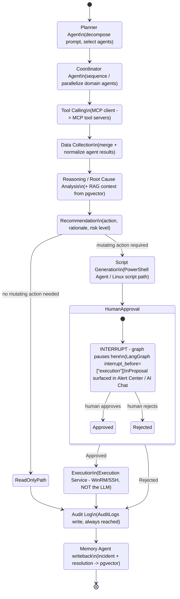
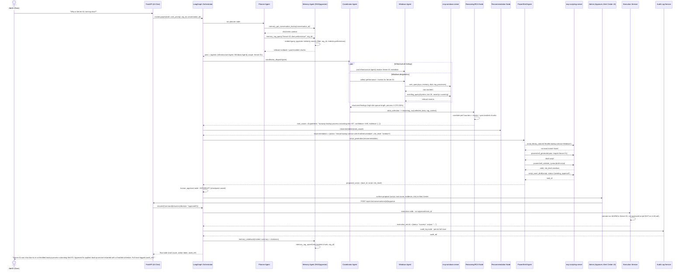

# 06. AI Architecture

This document specifies the multi-agent AI system for AI Infrastructure Copilot: the LangGraph orchestration graph, all 15 agents, the RAG/pgvector design, the MCP tool-server layer, and a full end-to-end workflow trace. It is written so a development team can implement the LangGraph graph and the MCP tool servers directly from this spec.

Full REST endpoint contracts live in `05-api-design.md`; this document lists only the endpoints each agent calls, by path and method, for traceability.

---

## 1. Design Principles

1. **Provider-agnostic LLM layer.** Every agent is a LangChain `Runnable` bound to an interface that can target the OpenAI API or a local model (Llama/Qwen/Mistral via vLLM/Ollama) without changing agent logic, tool schemas, or prompts. Model selection is a deployment-time configuration, not an agent-time decision.
2. **LangGraph as the state machine.** The entire AI workflow (`User Prompt → Planner → Agent Selection → Tool Calling → Data Collection → Reasoning → Root Cause Analysis → Recommendation → Script Generation → Human Approval → Execution → Audit Log`) is one LangGraph graph with a typed shared state, not a chain of ad hoc function calls.
3. **MCP as the only path to infrastructure.** No agent calls WinRM, SSH, WMI, cloud SDKs, or hypervisor APIs directly. Every tool call goes through an MCP client to an MCP tool server. This decouples the LLM/orchestrator from the tool implementations.
4. **No agent executes a mutating action.** Agents only ever produce a *proposed action* (a script, a command, a config change) attached to a `Tasks`/`Scripts` record with status `pending_approval`. A human approves or rejects it. A separate, deterministic **Execution Service** (not an LLM, not an agent) performs the approved action via WinRM/SSH and writes the result. Read-only diagnostic tools may auto-run without approval.
5. **Everything is auditable.** Every tool call, every RAG retrieval, every proposal, every approval/rejection, and every execution result is written to `AuditLogs`, keyed to the `AIConversations`/`AIMessages` that produced it.

---

## 2. LangGraph Orchestration Graph

### 2.1 Shared graph state

```python
class CopilotState(TypedDict):
    org_id: str
    conversation_id: str
    user_prompt: str
    messages: list[AnyMessage]            # running chat history (short-term memory)

    plan: list[PlanStep]                  # from Planner: {agent, goal, priority}
    selected_agents: list[str]             # canonical agent names to invoke

    tool_calls: list[ToolCall]             # MCP calls issued this turn
    collected_data: dict[str, Any]         # per-agent raw + normalized findings
    rag_context: list[RagChunk]            # retrieved runbook/incident chunks

    reasoning: str                        # chain-of-thought / analysis summary
    root_cause: RootCause | None           # {hypothesis, confidence, evidence[]}
    recommendation: Recommendation | None  # {action, rationale, risk_level}

    proposed_script: ProposedAction | None # {type, target, script_id, dry_run_result}
    approval: ApprovalDecision | None      # {decision, approver_id, comment, ts}

    execution_result: ExecutionResult | None
    audit_ref: str | None
    error: str | None
```

The state is persisted via LangGraph's checkpointer (Postgres-backed) so a paused-for-approval run can be resumed hours or days later without losing context, and so every intermediate step is recoverable/inspectable for audit.

### 2.2 Node list

| Node | Maps to workflow step | Behavior |
|---|---|---|
| `planner` | Planner, Agent Selection | Planner Agent decomposes `user_prompt`, queries Memory Agent for relevant short/long-term context, emits `plan` + `selected_agents` |
| `coordinator_dispatch` | Agent Selection | Coordinator Agent fans out to one or more domain agents (parallel `Send` when independent, sequential when dependent) |
| `tool_calling` | Tool Calling | Each dispatched domain agent issues MCP tool calls (read-only tools auto-run; mutating tools return proposals only) |
| `data_collection` | Data Collection | Coordinator Agent merges/normalizes results from all dispatched agents into `collected_data` |
| `reasoning_rca` | Reasoning, Root Cause Analysis | RCA reasoning pass over `collected_data` + `rag_context`, produces `reasoning` + `root_cause` |
| `recommendation` | Recommendation | Produces `recommendation` (action + rationale + risk level); read-only recommendations may skip straight to reporting |
| `script_generation` | Script Generation | PowerShell Agent or Linux/Bash-capable domain agent renders `recommendation` into a concrete script/command, validates syntax, computes risk level, writes `Scripts`/`Tasks` row as `pending_approval` |
| `human_approval` | Human Approval | **Interrupt point.** Graph pauses (`interrupt_before`) and surfaces the proposal to Alert Center / AI Chat UI; resumes on human decision |
| `execution` | Execution | Only reached if `approval.decision == "approved"`. Invokes the Execution Service (WinRM/SSH), not an LLM call |
| `audit_log` | Audit Log | Writes `AuditLogs` entry for the full trace (proposal, approver, execution result); always reached, including on rejection or read-only paths |
| `memory_writeback` | (feedback loop) | Memory Agent persists incident/resolution summary + embeddings back into pgvector for future RAG |

### 2.3 Graph diagram



The interrupt is implemented with LangGraph's human-in-the-loop primitive: the graph is compiled with `interrupt_before=["execution"]` (or an explicit `interrupt()` call inside the `human_approval` node), backed by a Postgres checkpointer. The API layer exposes `POST /api/v1/ai/conversations/{id}/approve` and `POST /api/v1/ai/conversations/{id}/reject`, which resume the graph with `Command(resume={"decision": ...})`. No code path allows `execution` to be entered without a persisted `approval.decision == "approved"` record.

---

## 3. The 15 AI Agents

Every agent is a LangGraph node (or subgraph) built on a LangChain agent runnable, calling out to MCP tool servers, backend REST APIs, and pgvector (via the Memory Agent). Order below is canonical and must not change.

### Infrastructure Agent

**Responsibilities**: Owns the org-wide infrastructure topology and inventory. Answers "what do we have / where does it live" questions, feeds asset context to every other domain agent, tracks discovery/reconciliation of Servers, Devices, and InfrastructureInventory.

**Tools** (`mcp-infra-server`):
| Tool | Type | Purpose |
|---|---|---|
| `infra_get_inventory` | read | List servers/devices for an org, with filters (platform, tag, health) |
| `infra_get_server_details` | read | Full detail record for one server/device |
| `infra_get_topology_map` | read | Dependency/topology graph (which app sits on which VM/host/cluster) |
| `infra_discover_assets` | read | Trigger a discovery scan against a subnet/credential set |
| `infra_tag_resource` | propose | Draft a tag/metadata change on a resource (mutating, needs approval) |

**APIs**: `GET /api/v1/servers`, `GET /api/v1/devices`, `GET /api/v1/infrastructure-inventory`, `POST /api/v1/infrastructure-inventory/discovery-jobs`.

**Context**: current org's server/device inventory snippet (filtered to what's relevant to the prompt), recent `Alerts` for those assets, topology relationships.

**Memory**: long-term (via Memory Agent) - canonical asset list, topology facts, naming conventions learned per org. Ephemeral - the specific filter/query used this turn.

**Prompt design**: "You are the Infrastructure Agent for AI Infrastructure Copilot. You own inventory and topology facts only; you do not diagnose OS-level or application-level issues yourself, you hand those to the Windows/Linux/Cloud/Virtualization agents. You never execute changes; you only report inventory state or draft a tagging/metadata proposal for human approval."

---

### Windows Agent

**Responsibilities**: Windows Server diagnostics and remediation proposals: services, IIS, event logs, WMI counters, performance, registry-level issues. Backs the Windows Event Log Analyzer, IIS Copilot, and Performance Analyzer modules.

**Tools** (`mcp-windows-server`):
| Tool | Type | Purpose |
|---|---|---|
| `winrm_run_readonly` | read | Run a whitelisted read-only PowerShell/CMD command over WinRM |
| `wmi_query` | read | Query WMI classes (CPU, memory, disk, process, service) |
| `eventlog_query` | read | Query Windows Event Viewer logs (Application/System/Security) with filters |
| `perf_get_counters` | read | Pull performance counter history for CPU/memory/disk/network |
| `iis_get_site_status` | read | IIS site/app-pool status, bindings, recent errors |
| `service_get_status` | read | Windows service status/start-mode |
| `service_restart` | propose | Draft a service restart action (mutating) |
| `registry_read` | read | Read a registry key/value for diagnostics |

**APIs**: `GET /api/v1/servers/{id}/events`, `GET /api/v1/servers/{id}/performance`, `GET /api/v1/iis/sites`, `POST /api/v1/tasks` (to persist the proposal), `GET /api/v1/scripts?category=windows`.

**Context**: target server's OS/version/roles, recent Event Viewer entries relevant to the symptom, current performance counters, RAG runbook chunks tagged `windows`.

**Memory**: long-term - recurring failure signatures and their confirmed fixes per server/org (e.g., "Server-01 CPU spikes correlate with backup job at 2am"). Ephemeral - raw event/perf payloads for this turn only.

**Prompt design**: "You are the Windows Agent. You diagnose Windows Server, IIS, and Event Log issues using only the read-only tools available to you; you never restart a service, change a registry value, or modify IIS config directly. When a fix requires a mutating action, describe it precisely and hand it to the PowerShell Agent to generate a reviewable script."

---

### Linux Agent

**Responsibilities**: Linux diagnostics and remediation proposals: systemd units, journald logs, cron, bash-level troubleshooting. Backs Performance Analyzer and Server Health Dashboard for Linux hosts.

**Tools** (`mcp-linux-server`):
| Tool | Type | Purpose |
|---|---|---|
| `ssh_run_readonly` | read | Run a whitelisted read-only shell command over SSH |
| `systemd_get_status` | read | Unit status, recent restarts, failure reason |
| `systemd_restart_unit` | propose | Draft a unit restart/reload (mutating) |
| `journalctl_query` | read | Query journald with unit/time/priority filters |
| `cron_list` | read | List cron jobs for a host/user |
| `cron_update` | propose | Draft a cron entry change (mutating) |
| `bash_script_run` | propose | Draft execution of a generated bash script (mutating) |

**APIs**: `GET /api/v1/servers/{id}/events`, `GET /api/v1/servers/{id}/performance`, `POST /api/v1/tasks`, `GET /api/v1/scripts?category=linux`.

**Context**: distro/kernel version, relevant journalctl excerpt, cron table, RAG runbook chunks tagged `linux`.

**Memory**: long-term - confirmed root causes for recurring Linux incidents per host/org. Ephemeral - raw journal/log excerpts for this turn.

**Prompt design**: "You are the Linux Agent. You diagnose systemd, journald, and cron issues using read-only SSH tools only. You never restart a unit, edit a crontab, or run a script directly; you produce a precise proposal and pass script drafting to the Bash Script Generator path for human approval."

---

### Cloud Agent

**Responsibilities**: Cross-cloud visibility and remediation proposals across Azure, AWS, and GCP: resource inventory, metrics, cost, tagging, right-sizing. Backs Cloud Management module.

**Tools** (`mcp-cloud-server`):
| Tool | Type | Purpose |
|---|---|---|
| `cloud_azure_list_resources` | read | List Azure resources by subscription/resource group/tag |
| `cloud_aws_list_resources` | read | List AWS resources by account/region/tag |
| `cloud_gcp_list_resources` | read | List GCP resources by project |
| `cloud_get_vm_metrics` | read | CPU/memory/disk/network metrics for a cloud VM, provider-agnostic wrapper |
| `cloud_get_cost_report` | read | Cost/usage breakdown for a scope and time range |
| `cloud_resize_vm` | propose | Draft a VM SKU/size change (mutating) |
| `cloud_apply_tag` | propose | Draft a tag/label change (mutating) |

**APIs**: `GET /api/v1/cloud/resources`, `GET /api/v1/cloud/metrics`, `GET /api/v1/cloud/cost-reports`, `POST /api/v1/tasks`.

**Context**: cloud account/subscription/project scope, relevant resource metadata and metrics window, cost anomalies, RAG chunks tagged `cloud`/provider name.

**Memory**: long-term - cost/rightsizing patterns and prior approved resize actions per org. Ephemeral - metric snapshots for this turn.

**Prompt design**: "You are the Cloud Agent, covering Azure, AWS, and GCP through provider-agnostic tools. You report resource state, metrics, and cost; you never resize, retag, or delete a cloud resource yourself; every such change is a proposal routed through Human Approval."

---

### Active Directory Agent

**Responsibilities**: Active Directory and Group Policy: users, groups, OUs, GPOs, replication health, lockouts. Backs Active Directory Management and Group Policy Management modules.

**Tools** (`mcp-ad-server`):
| Tool | Type | Purpose |
|---|---|---|
| `ad_query_users` | read | Query user accounts/attributes/lockout state |
| `ad_query_groups` | read | Query group membership |
| `ad_query_ou` | read | Query OU structure |
| `ad_get_gpo` | read | Fetch GPO definition/links/settings |
| `ad_get_replication_status` | read | Domain controller replication health |
| `ad_get_lockout_events` | read | Recent account lockout events with source DC |
| `ad_apply_gpo` | propose | Draft a GPO create/edit/link change (mutating) |
| `ad_reset_password` | propose | Draft a password reset/unlock action (mutating) |

**APIs**: `GET /api/v1/active-directory/users`, `GET /api/v1/active-directory/groups`, `GET /api/v1/group-policy/objects`, `POST /api/v1/tasks`.

**Context**: relevant OU/GPO scope, recent lockout/replication events, RAG chunks of GPO documentation relevant to the symptom.

**Memory**: long-term - org's GPO baseline, known-safe GPO change patterns, past lockout root causes. Ephemeral - specific user/group query results for this turn.

**Prompt design**: "You are the Active Directory Agent. You read AD and GPO state only through the provided query tools. You never modify a GPO, reset a password, or unlock an account directly; you draft the exact change with its blast radius (which OUs/users are affected) for human approval."

---

### PowerShell Agent

**Responsibilities**: Generates, validates, and risk-rates PowerShell scripts requested by other agents (mainly Windows Agent and Active Directory Agent) or directly by the user via PowerShell Generator module. Owns the PowerShell half of Script Generation.

**Tools** (`mcp-scripting-server`):
| Tool | Type | Purpose |
|---|---|---|
| `powershell_generate` | read | Generate a PowerShell script from a natural-language spec + parameters |
| `powershell_validate_syntax` | read | Static syntax/lint check (PSScriptAnalyzer-equivalent) |
| `powershell_dry_run` | read | Execute against a sandboxed/what-if target where supported (`-WhatIf`) |
| `script_library_search` | read | Search `Script Library` for an existing vetted script before generating a new one |
| `script_save_draft` | propose | Persist the generated script as a `pending_approval` `Scripts`/`Tasks` row (this is the proposal, not an execution) |

**APIs**: `GET /api/v1/scripts?category=powershell`, `POST /api/v1/scripts`, `POST /api/v1/tasks`.

**Context**: the recommendation/root cause it is scripting for, target server OS/version, any org-specific scripting conventions from long-term memory, similar past scripts from Script Library via RAG.

**Memory**: long-term - the org's approved script variants become new Script Library / RAG entries once executed successfully. Ephemeral - intermediate draft revisions before approval.

**Prompt design**: "You are the PowerShell Agent. You only ever produce a script and a plain-language description of exactly what it will change and its risk level; you never run it. Prefer reusing a vetted Script Library entry over generating a new script when one already fits. Always include a `-WhatIf`-safe dry-run path when the target cmdlet supports it."

---

### Security Agent

**Responsibilities**: Vulnerability posture, compliance checks, failed-login/anomaly detection, firewall/MFA state. Backs Security Center and Alert Center for security-classed alerts.

**Tools** (`mcp-security-server`):
| Tool | Type | Purpose |
|---|---|---|
| `sec_scan_vulnerabilities` | read | Run/read a vulnerability scan result for a host or scope |
| `sec_get_cve_matches` | read | Match installed software/versions to known CVEs |
| `sec_check_compliance` | read | Evaluate a host/policy against a compliance baseline (CIS, org policy) |
| `sec_get_failed_logins` | read | Recent auth failures/anomalies across Windows/Linux/AD |
| `sec_get_mfa_status` | read | MFA enrollment/enforcement status for users |
| `sec_apply_firewall_rule` | propose | Draft a firewall rule add/change (mutating) |

**APIs**: `GET /api/v1/security/vulnerabilities`, `GET /api/v1/security/compliance`, `GET /api/v1/security/events`, `POST /api/v1/tasks`.

**Context**: relevant compliance baseline/policy, recent security `Alerts`/`Events`, CVE data for installed software, RAG chunks of security runbooks/KB articles.

**Memory**: long-term - org's compliance baseline, accepted-risk exceptions, recurring threat patterns. Ephemeral - raw scan results for this turn.

**Prompt design**: "You are the Security Agent. You assess vulnerability, compliance, and access-anomaly state; you never change a firewall rule, disable an account, or alter a policy directly. Flag severity honestly, do not downplay risk to close a ticket faster, and always cite the specific finding (CVE, failed policy check, anomalous login) behind any recommendation."

---

### Network Agent

**Responsibilities**: DNS, DHCP, connectivity, and firewall visibility. Backs DNS Manager and DHCP Manager modules.

**Tools** (`mcp-network-server`):
| Tool | Type | Purpose |
|---|---|---|
| `net_get_dns_records` | read | Query DNS zone/records |
| `net_get_dhcp_leases` | read | Query DHCP scope/lease state |
| `net_run_traceroute` | read | Run a traceroute/path check between two endpoints |
| `net_check_port` | read | TCP/UDP port reachability check |
| `firewall_get_rules` | read | List firewall rules for a host/segment |
| `net_update_dns_record` | propose | Draft a DNS record add/change (mutating) |
| `net_update_dhcp_scope` | propose | Draft a DHCP scope/reservation change (mutating) |

**APIs**: `GET /api/v1/network/dns/zones`, `GET /api/v1/network/dhcp/scopes`, `POST /api/v1/tasks`.

**Context**: relevant DNS zone/DHCP scope, recent connectivity-related `Alerts`, RAG chunks on network runbooks.

**Memory**: long-term - stable network topology facts (zones, scopes, known firewall segmentation). Ephemeral - specific lookup/traceroute results.

**Prompt design**: "You are the Network Agent. You diagnose DNS, DHCP, and connectivity issues using read-only tools; you never edit a DNS record, DHCP scope, or firewall rule directly. Always state which segment/zone/scope is affected before proposing a change."

---

### VMware Agent

**Responsibilities**: VMware vSphere/ESXi health: VM health, datastore usage, cluster/resource pool state, snapshots, migrations. Backs VMware Management module.

**Tools** (`mcp-virtualization-server`):
| Tool | Type | Purpose |
|---|---|---|
| `vmware_get_vm_health` | read | VM power/resource/health state |
| `vmware_get_datastore_usage` | read | Datastore capacity/latency/usage |
| `vmware_get_cluster_status` | read | Cluster/HA/DRS status |
| `vmware_get_resource_pool_usage` | read | Resource pool allocation/usage |
| `vmware_snapshot_vm` | propose | Draft a snapshot creation/removal (mutating) |
| `vmware_migrate_vm` | propose | Draft a vMotion/Storage vMotion action (mutating) |

**APIs**: `GET /api/v1/vmware/vms`, `GET /api/v1/vmware/datastores`, `GET /api/v1/vmware/clusters`, `POST /api/v1/tasks`.

**Context**: relevant cluster/datastore/VM state, recent VMware-related `Alerts`, RAG chunks on virtualization runbooks.

**Memory**: long-term - cluster capacity baselines and past migration/snapshot decisions and outcomes. Ephemeral - point-in-time health snapshots.

**Prompt design**: "You are the VMware Agent. You report VM, datastore, and cluster health; you never create/delete a snapshot or migrate a VM directly. State the capacity or health risk driving any proposal and the expected impact of the action."

---

### Hyper-V Agent

**Responsibilities**: Hyper-V host/cluster and VM health, checkpoints, replication. Backs Hyper-V Management module.

**Tools** (`mcp-virtualization-server`):
| Tool | Type | Purpose |
|---|---|---|
| `hyperv_get_vm_health` | read | VM state/resource health |
| `hyperv_get_cluster_status` | read | Failover cluster health |
| `hyperv_get_replica_status` | read | Hyper-V Replica health/lag |
| `hyperv_create_checkpoint` | propose | Draft a checkpoint create/apply/remove (mutating) |
| `hyperv_move_vm` | propose | Draft a live migration action (mutating) |

**APIs**: `GET /api/v1/hyperv/vms`, `GET /api/v1/hyperv/clusters`, `POST /api/v1/tasks`.

**Context**: relevant host/cluster/VM state, recent Hyper-V `Alerts`, RAG chunks on Hyper-V runbooks.

**Memory**: long-term - cluster baselines and past checkpoint/migration outcomes. Ephemeral - point-in-time health data.

**Prompt design**: "You are the Hyper-V Agent. You report VM, cluster, and replication health; you never create a checkpoint or move a VM directly. Always note replication lag or cluster quorum risk before proposing any state-changing action."

---

### Automation Agent

**Responsibilities**: Turns approved recommendations into scheduled or reusable Automation Workflows; owns workflow definition, scheduling, and job status, but not raw script authoring (that is PowerShell/Bash generation) or the final approved execution (that is the Execution Service).

**Tools** (`mcp-automation-server`):
| Tool | Type | Purpose |
|---|---|---|
| `automation_get_job_status` | read | Status/history of an automation job |
| `automation_create_workflow` | propose | Draft a new multi-step workflow definition (mutating - creates a `Workflows` record pending approval before it can run unattended) |
| `automation_schedule_job` | propose | Draft a schedule (cron-like) for an existing approved workflow |
| `automation_run_workflow` | propose | Draft an on-demand run request for an existing workflow; the actual run still passes through Human Approval for any mutating step inside it |

**APIs**: `GET /api/v1/automation-jobs`, `GET /api/v1/workflows`, `POST /api/v1/tasks`.

**Context**: existing workflow definitions relevant to the request, past job run history/success rate, RAG chunks on automation patterns used elsewhere in the org.

**Memory**: long-term - the org's library of approved, reusable workflows and their success/failure rates. Ephemeral - a single job's run-time parameters.

**Prompt design**: "You are the Automation Agent. You design and schedule workflows out of already-approved steps and scripts; you never mark a workflow as unattended-safe yourself and you never trigger a run that contains an unapproved mutating step. Every new workflow or schedule is a proposal until a human approves it."

---

### Reporting Agent

**Responsibilities**: Turns agent findings, RCA output, and execution outcomes into human-readable reports and scheduled digests (weekly summaries, incident postmortems). Backs Reporting and contributes to Server Health Dashboard/Alert Center summaries.

**Tools** (`mcp-reporting-server`):
| Tool | Type | Purpose |
|---|---|---|
| `report_generate_summary` | read | Compose a structured summary from a conversation/incident trace |
| `report_export_pdf` | read | Render a report to PDF/HTML for download |
| `report_get_metrics_history` | read | Pull historical metrics/trend data to include in a report |
| `report_schedule_weekly_digest` | propose | Draft a recurring digest schedule (mutating - creates a scheduled job) |

**APIs**: `GET /api/v1/reports`, `POST /api/v1/reports`, `GET /api/v1/servers/{id}/performance`, `GET /api/v1/audit-logs`.

**Context**: the full incident/conversation trace (root cause, recommendation, approval, execution result), historical trend data, org branding/report template preferences from long-term memory.

**Memory**: long-term - report templates and org preferences (tone, cadence, recipients). Ephemeral - the specific report draft being composed.

**Prompt design**: "You are the Reporting Agent. You summarize what happened, why, and what was done, in plain language for a non-specialist reader, always citing the underlying evidence and audit record. You do not add recommendations that were not already proposed by a domain agent; you report, you do not diagnose."

---

### Planner Agent

**Responsibilities**: The graph's entry point. Decomposes the raw user prompt into a plan, decides which domain agent(s) (Windows, Linux, Cloud, Active Directory, PowerShell, Security, Network, VMware, Hyper-V, Automation, Reporting, Infrastructure) must be invoked and in what order/parallelism, and hands the plan to the Coordinator Agent.

**Tools**: Planner has no direct MCP infrastructure tools. It calls the Memory Agent's retrieval interface and the Infrastructure Agent's inventory read tools indirectly through the plan it produces; its own "tool" is an internal `planner_decompose_intent` LangChain structured-output call (intent, entities, target servers/scope, urgency) rather than an MCP tool-server call.

**APIs**: `GET /api/v1/ai/conversations/{id}` (to load prior turns), `GET /api/v1/servers` (light lookup, to resolve which server the prompt refers to).

**Context**: the raw user prompt, short-term conversation history from the Memory Agent, a lightweight inventory snippet to resolve ambiguous server/device names, module list to know which domains exist.

**Memory**: long-term - none directly (it delegates persistence to the Memory Agent). Ephemeral - the current turn's plan and agent-selection rationale, discarded once the turn completes (though logged to `AIMessages` for audit).

**Prompt design**: "You are the Planner Agent. Given a user's natural-language request, identify the true intent, the target scope (servers/devices/policies), and which specialist agent(s) are needed; never invent a diagnosis or fix yourself, only produce a plan. If the request is ambiguous, ask a clarifying question instead of guessing the scope."

---

### Memory Agent

**Responsibilities**: The memory substrate for every other agent. Manages short-term (per-conversation) memory and long-term (org-specific facts, past incidents/resolutions, RAG index) memory, and is the sole writer/reader of pgvector on behalf of other agents.

**Tools** (`mcp-memory-server`):
| Tool | Type | Purpose |
|---|---|---|
| `memory_get_conversation_history` | read | Fetch recent turns for the active `AIConversations` thread |
| `memory_rag_query` | read | Embed a query and run a pgvector similarity search, scoped by org/module/tags |
| `memory_get_incident_history` | read | Fetch past incidents/resolutions matching a symptom/asset |
| `memory_store_fact` | write | Persist a durable org fact (topology, naming convention, policy exception) |
| `memory_rag_upsert` | write | Chunk, embed, and upsert a new document/resolution into pgvector |
| `memory_summarize_conversation` | read | Compress a long conversation into a durable summary for future retrieval |

**APIs**: `GET /api/v1/ai/conversations/{id}/messages`, `POST /api/v1/ai/conversations/{id}/messages`, internal pgvector access (no public REST surface beyond the AI Chat endpoints).

**Context**: whatever the requesting agent asks it to retrieve; it does not carry its own broad context beyond the active org scope and conversation id.

**Memory**: this agent *is* the memory system. Short-term: conversation buffer (windowed, summarized when it exceeds a token budget). Long-term: org facts, incident/resolution corpus, script library embeddings, runbook/KB embeddings, all in pgvector plus relational metadata in Postgres.

**Prompt design**: "You are the Memory Agent. You retrieve the smallest sufficient context for the requesting agent's query and you never fabricate a memory that was not actually stored. When asked to write back an incident resolution, capture the symptom, root cause, action taken, and outcome as a single retrievable unit."

---

### Coordinator Agent

**Responsibilities**: Executes the Planner's plan: sequences dependent steps, parallelizes independent domain-agent calls (e.g., Windows Agent + Infrastructure Agent gathering data simultaneously), merges their outputs into one normalized `collected_data` payload, and handles partial failures (one agent errors, others still complete).

**Tools**: No direct MCP infrastructure tools of its own; it dispatches to other agents' tools via LangGraph's `Send` API for fan-out/fan-in and merges results. Internally uses `coordinator_dispatch` and `coordinator_merge_results` as LangGraph node functions, not MCP calls.

**APIs**: none directly; it operates purely on in-graph state and other agents' outputs. It does write a `Tasks` row per dispatched sub-step for traceability (`POST /api/v1/tasks`).

**Context**: the Planner's plan, and the live results streaming back from each dispatched agent.

**Memory**: long-term - which agent combinations/sequences historically resolved which class of prompt (fed back from Reporting Agent outcomes). Ephemeral - the specific dispatch/merge state for the current turn.

**Prompt design**: "You are the Coordinator Agent. You do not diagnose or recommend; you sequence and parallelize the domain agents the Planner selected, and merge their findings into one consistent record. If a dispatched agent fails or times out, note the gap explicitly rather than silently dropping its part of the picture."

---

## 4. RAG + Vector Database Design

### 4.1 What gets embedded

| Source | Table/origin | Notes |
|---|---|---|
| Runbooks (internal + imported KB) | `InfrastructureInventory`-linked docs / uploaded KB | Chunked by section/heading |
| Past incident resolutions | written back by Memory Agent after `audit_log` | symptom + root cause + action + outcome as one unit |
| Script Library entries | `Scripts` | description + parameters + risk notes; the script body itself is stored relationally, only the description/usage is embedded |
| KB articles | uploaded/curated | vendor docs, internal wiki exports |
| GPO documentation | AD Agent-authored or imported | GPO name, setting, intended effect, applicable OU scope |

Each embedded chunk is stored in a single `pgvector`-enabled table (e.g., `rag_chunks`) with columns: `id`, `org_id`, `source_type` (`runbook`|`incident`|`script`|`kb`|`gpo_doc`), `source_id` (FK to the originating row where applicable), `content`, `embedding vector(1536)` (or the local embedding model's dimension), `metadata jsonb` (tags, module, platform, severity), `created_at`.

### 4.2 Chunking strategy

- Semantic/heading-aware chunking for runbooks/KB/GPO docs: target 500-800 tokens per chunk with roughly 15% overlap, split preferentially at headings/step boundaries rather than mid-procedure.
- Incident resolutions are chunked as one unit per incident (they are already short and coherent): symptom, root cause, action taken, outcome, target asset type, so retrieval returns a complete case rather than a fragment.
- Script Library entries are chunked as one unit per script version (description + parameters + risk level + when-to-use notes), not the raw script body, to keep retrieval focused on *applicability* rather than syntax.
- Every chunk carries `org_id` for tenant isolation and `module`/`platform` tags (e.g., `windows`, `active-directory`, `vmware`) so retrieval can be filtered, not just ranked.

### 4.3 Retrieval flow

1. A domain agent (or the Planner/Reasoning node) calls `memory_rag_query(text, org_id, filters, top_k)` on the Memory Agent.
2. Memory Agent embeds the query text using the same embedding model configured for the active LLM provider (OpenAI embeddings for the hosted path, a local embedding model such as `bge`/`nomic-embed` served via Ollama for the on-prem path), keeping embedding and query text in the same vector space per deployment.
3. A pgvector cosine-similarity search (`ORDER BY embedding <=> query_embedding`) runs with a mandatory `org_id` filter plus optional `source_type`/`module` filters, returning `top_k` candidates (typically 5-10).
4. Results are optionally reranked (cross-encoder or simple recency/severity boosting) and trimmed to fit the context budget.
5. Retrieved chunks are injected into the requesting node's prompt as a labeled "Relevant Knowledge" block, each chunk tagged with its `source_type` and `source_id` so the agent can cite it in `root_cause.evidence[]`.

### 4.4 Write-back / feedback loop

After `audit_log` (and regardless of whether the human approved or rejected the proposal), the Memory Agent:
1. Calls `memory_summarize_conversation` to produce a compact incident record (symptom, root cause, recommendation, decision, execution result).
2. Calls `memory_rag_upsert` to embed and store that record as a new `incident` chunk in `rag_chunks`, tagged with the asset/module/platform involved.
3. If the resolution introduced a new or modified script that was approved and executed successfully, it also upserts/refreshes the corresponding Script Library `source_type = 'script'` chunk so future retrieval favors the proven fix.

This closes the loop: every resolved incident makes the next similar incident's RCA faster and more consistent, without any manual re-authoring of runbooks.

---

## 5. MCP Tool-Server Design

### 5.1 Why MCP

- **Standard tool interface decoupled from the LLM provider.** Both the OpenAI API and local models (via an MCP-compatible LangChain/LangGraph tool adapter over vLLM/Ollama) call the exact same tool schemas. Switching the LLM provider for a deployment never requires touching a tool server.
- **Least-privilege, centralized credential handling.** MCP servers hold and use `Credentials` (vaulted) directly against target infrastructure; the LLM only ever sees tool names, JSON-schema parameters, and results, never raw secrets.
- **Independent scaling/isolation.** Each MCP server can be deployed, scaled, and network-restricted independently (e.g., `mcp-windows-server` needs WinRM egress to Windows subnets only).
- **Safety boundary for mutation.** MCP tools are explicitly annotated `read` (safe to auto-run) or `propose` (never touches the target, only returns a structured proposed action). This annotation is enforced at the tool-server level, not just trusted from the LLM's behavior, so a prompt-injected or misbehaving agent cannot escalate a `propose` tool into a real mutation.

### 5.2 Server topology

| MCP server | Domains covered | Consumed by |
|---|---|---|
| `mcp-windows-server` | WinRM, WMI, PowerShell read-ops, Event Viewer, IIS | Windows Agent |
| `mcp-linux-server` | SSH, systemd, journalctl, cron, bash read-ops | Linux Agent |
| `mcp-ad-server` | Active Directory, Group Policy | Active Directory Agent |
| `mcp-scripting-server` | PowerShell/Bash generation, syntax validation, dry-run, Script Library search | PowerShell Agent, and used by Windows/Linux Agents to request drafts |
| `mcp-cloud-server` | Azure, AWS, GCP resource/metrics/cost APIs | Cloud Agent |
| `mcp-virtualization-server` | VMware vSphere, Hyper-V | VMware Agent, Hyper-V Agent |
| `mcp-network-server` | DNS, DHCP, connectivity, firewall visibility | Network Agent |
| `mcp-security-server` | Vulnerability scan, compliance, auth anomalies | Security Agent |
| `mcp-automation-server` | Workflow/job scheduling and status | Automation Agent |
| `mcp-reporting-server` | Report composition/export | Reporting Agent |
| `mcp-memory-server` | pgvector RAG, conversation memory | Memory Agent |

Each server is a standard MCP server (stdio or streamable-HTTP transport) registered with the orchestrator's MCP client at startup via a tool manifest (name, JSON schema, `read`/`propose` annotation, target platform). The FastAPI backend hosts a single MCP client used by every LangGraph node; LangGraph nodes never open ad hoc network connections to infrastructure themselves.

### 5.3 Mutation boundary, concretely

For any `propose`-annotated tool (e.g., `service_restart`, `ad_apply_gpo`, `cloud_resize_vm`, `vmware_migrate_vm`):
1. The tool validates parameters and computes the exact command/script/API call that *would* run.
2. It writes a `Scripts`/`Tasks` row with `status = "pending_approval"` and returns that row's id plus a human-readable diff/description to the calling agent. **It does not contact the target host, hypervisor, or cloud API.**
3. Only after `human_approval` resolves to `approved` does the backend's **Execution Service** (a plain deterministic service, not an LLM or MCP tool invoked by the agent) read the approved `Tasks` row and perform the real WinRM/SSH/API call, then write `execution_result` and flip the `Tasks` status to `executed` or `failed`.

This means the same underlying WinRM/SSH client libraries are used for both the `read` tools (which do connect, but only to read) and the actual execution, but the *decision to mutate* never lives inside a tool an agent can call unattended.

---

## 6. Full AI Workflow: End-to-End Example

Scenario: an admin asks "Why is Server-01 running slow?" The trace below shows every hop from prompt to audited execution.



Key properties this trace demonstrates:
- The Windows Agent only ever called `read` tools during data collection; nothing on Server-01 was touched until approval.
- The graph genuinely paused (`human_approval` interrupt) with state checkpointed, and resumed only on an explicit `approve` API call from the Admin.
- `execution` was performed by a deterministic Execution Service, not by any agent or LLM call.
- The `audit_log` node runs unconditionally, and the `memory_writeback` step means the next "server running slow" question anywhere in the org retrieves this resolved incident as prior art.
