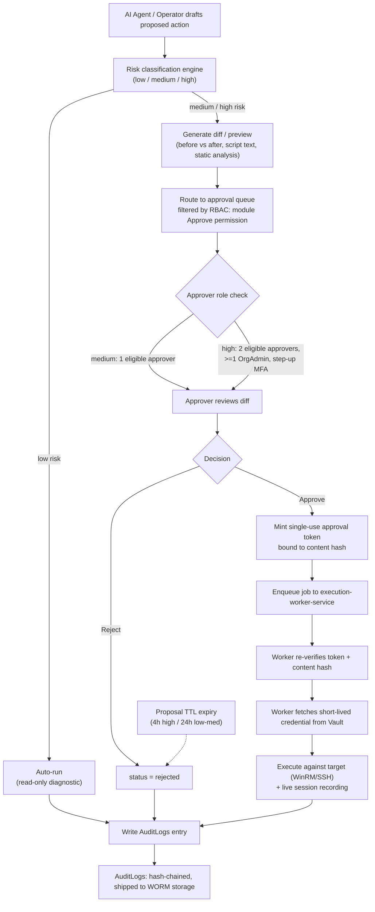

# 07 - Security Architecture

## 0. Scope and Principles

AI Infrastructure Copilot lets human operators issue natural-language requests that AI agents turn into diagnostics, root-cause analysis, and proposed remediation (scripts, GPO edits, service restarts). Because the platform can ultimately touch production Windows/Linux/Cloud/Virtualization infrastructure, security is not a bolt-on module, it is the core constraint the rest of the architecture is designed around.

Guiding principles:

- **Least privilege by default.** Every Role starts with read-only access; write and execute capabilities are opt-in per module.
- **Human Approval gate on every mutation.** No AI agent or automated workflow can change target infrastructure state without an explicit, RBAC-scoped human approval. Read-only diagnostics may auto-run without approval.
- **Credentials never touch the main backend.** Only the isolated `execution-worker-service` holds WinRM/SSH credentials, and even there they are pulled just-in-time from the vault.
- **Everything is audited.** Every state-changing action, every approval decision, and every credential access is written to `AuditLogs` in an immutable, verifiable form.
- **Zero trust between services.** No pod or service is trusted by network location alone; identity and mTLS gate every internal call.

---

## 1. RBAC Model

### 1.1 Roles

Roles are scoped to an Organization (multi-tenant). A User can hold different Roles in different Organizations, but not different Roles within the same Organization (single active Role per org membership, assigned via the `Roles` and `Permissions` tables).

| Role | Intended holder | Summary |
|---|---|---|
| **SuperAdmin** | AI Infrastructure Copilot platform operator (internal, cross-tenant) | Full access across all Organizations. Used only by platform staff for support/ops. Every action is audited and requires MFA + step-up auth. Cannot be assigned by OrgAdmins. |
| **OrgAdmin** | Customer's IT/security lead | Full control within their Organization: manage Users, Roles, Credentials, integrations (Azure AD SSO, Vault), and approve any action including high-risk ones. |
| **Operator** | Sysadmins doing day-to-day remediation | Can read all modules, can propose changes (scripts, GPO edits, service actions) via AI Chat / module UIs, can approve **low/medium-risk** proposals (including their own, except where dual-control is required), cannot approve **high-risk** proposals. |
| **Viewer** | Read-only stakeholders (NOC, junior staff, auditors-in-training) | Read-only across all modules. Can view dashboards, alerts, audit trails, and chat history, but cannot propose or approve any change. |
| **Auditor** | Compliance / security review | Read-only, but with elevated visibility into AuditLogs, session recordings, and approval chains (including data Viewer cannot see, e.g. before/after diffs of scripts and full session recordings). Cannot propose or approve changes. |

Custom roles can be composed from the underlying `Permissions` set (see 1.3) for customers who need finer granularity (e.g. "IIS Copilot Operator" limited to one module), but the five roles above are the shipped defaults and cover the permission matrix below.

### 1.2 Permission levels

Each Role/Module pair resolves to one of four permission levels, stored as rows in `Permissions` and referenced by `Roles`:

- **None** - module hidden entirely.
- **Read** - view dashboards, inventory, logs, past chat/automation history for that module.
- **Propose** - Read, plus can ask the AI agent to diagnose and generate a change (script, GPO edit, config change) and submit it into the Human Approval gate. Read-only diagnostics within the module still auto-run.
- **Approve** - Propose, plus can act as an approver on the Human Approval gate for that module, subject to the multi-approver policy in Section 9.

### 1.3 Permission matrix (Role x Module)

`R` = Read, `P` = Propose, `A` = Approve, `-` = No access. SuperAdmin has `A` on every module in every Organization and is omitted from the table for readability (it is simply "A everywhere").

| # | Module | OrgAdmin | Operator | Viewer | Auditor |
|---|---|---|---|---|---|
| 1 | Authentication | A | R | - | R |
| 2 | Infrastructure Inventory | A | P | R | R |
| 3 | Active Directory Management | A | P | R | R |
| 4 | Group Policy Management | A | P | R | R |
| 5 | Windows Event Log Analyzer | A | P | R | R |
| 6 | IIS Copilot | A | P | R | R |
| 7 | DNS Manager | A | P | R | R |
| 8 | DHCP Manager | A | P | R | R |
| 9 | Performance Analyzer | A | P | R | R |
| 10 | PowerShell Generator | A | P | R | R |
| 11 | Bash Script Generator | A | P | R | R |
| 12 | Script Library | A | P | R | R |
| 13 | Server Health Dashboard | A | R | R | R |
| 14 | Alert Center | A | P | R | R |
| 15 | Security Center | A | R | - | R |
| 16 | AI Chat | A | P | R | R |
| 17 | Automation Workflows | A | P | R | R |
| 18 | VMware Management | A | P | R | R |
| 19 | Hyper-V Management | A | P | R | R |
| 20 | Cloud Management | A | P | R | R |

Notes:

- **Authentication** and **Security Center** are OrgAdmin-only for write (MFA policy, SSO config, Vault config, rate-limit policy); Viewers have no access to Security Center because it exposes credential metadata and audit configuration, Auditors get Read for compliance review.
- **Operator = Approve on their own low/medium-risk proposals** is a policy flag, not a table cell; it is enforced in the approval engine (Section 9), not by giving Operator blanket `A` in the matrix.
- High-risk actions (defined per module, e.g. any GPO change at the domain-root OU, any DHCP scope deletion, any production VM power-off) always require an OrgAdmin (or a second Operator, per policy) approval regardless of who is listed as `A` above.

### 1.4 Enforcement

- Every FastAPI route is decorated with a required `(module, permission_level)` dependency that resolves the caller's effective permission from `Roles` -> `Permissions` for the request's Organization context.
- The AI orchestrator checks permission **before** invoking a mutating tool call, not just before display, so a prompt-injected agent cannot bypass RBAC by acting instead of proposing.
- `execution-worker-service` independently re-validates that the job it received carries a valid, unexpired, correctly-scoped approval token (Section 9) before opening any WinRM/SSH connection. It does not trust the backend's word alone.

---

## 2. Multi-Factor Authentication (MFA)

### 2.1 Supported factors

- **TOTP** (RFC 6238): standard authenticator apps (Google Authenticator, Authy, 1Password, etc.). Secret generated server-side, shown once as QR + manual entry code, encrypted at rest (Section 6), 8 backup/recovery codes issued at enrollment (single-use, hashed at rest).
- **WebAuthn / Passkeys** (FIDO2): platform authenticators (Windows Hello, Touch ID) and roaming authenticators (hardware security keys). Preferred factor for OrgAdmin and SuperAdmin because it is phishing-resistant.
- **Email OTP** is intentionally *not* offered as a standalone MFA factor (SIM-swap/email-compromise risk), it exists only as an account-recovery fallback with additional friction (rate-limited, logged, requires support ticket for SuperAdmin resets).

### 2.2 Enforcement policy

| Condition | Requirement |
|---|---|
| SuperAdmin | WebAuthn required. TOTP alone not accepted. |
| OrgAdmin | MFA required (TOTP or WebAuthn) - enforced at Organization level, cannot self-disable. |
| Operator / Viewer / Auditor | MFA required by default; OrgAdmin can enforce org-wide via Security Center policy toggle (cannot be turned fully off for orgs with Approve-level access on any module). |
| Approving a **high-risk** action | Step-up re-authentication (fresh MFA challenge, <5 min old) required at approval time, regardless of session MFA state. |
| New device / new IP range / impossible-travel | Step-up MFA challenge on next login. |
| Azure AD SSO users | MFA is delegated to the IdP (Conditional Access) but the platform still enforces step-up re-auth for high-risk approvals using WebAuthn or TOTP registered locally, since the platform cannot trust IdP session freshness for that decision. |

MFA state, enrollment timestamps, and last-used timestamps are stored per-User; MFA secrets are stored as vault references (Section 5), never as plaintext columns.

---

## 3. JWT / Session Management

### 3.1 Token design

- **Access token**: JWT (RS256, asymmetric so `execution-worker-service` and other internal services can verify without holding the signing key), TTL **10 minutes**, claims: `sub` (user id), `org_id`, `role`, `permissions_version`, `mfa_verified_at`, `jti`.
- **Refresh token**: opaque random 256-bit token (not a JWT), TTL **7 days** (sliding), stored hashed (SHA-256) in Postgres keyed by `user_id`, `device_id`, `jti_family`. Presented only to a dedicated `/auth/refresh` endpoint over TLS, never sent to any other service.
- Access tokens are short-lived on purpose so that a compromised token self-expires quickly; refresh tokens carry the longer-lived trust and are rotated on every use.

### 3.2 Rotation

- **Refresh token rotation**: every successful `/auth/refresh` call issues a brand-new refresh token and immediately invalidates the previous one (`jti_family` chain). If a already-used (rotated-out) refresh token is presented again, the entire `jti_family` is revoked and the user is forced to re-authenticate, this is the standard "refresh token reuse detection" signal for theft.
- **Access token rotation**: implicit, a new access token is minted on each refresh; no separate revocation needed thanks to the short TTL, but see 3.3 for the fast-path.
- `permissions_version` is an org-level counter bumped whenever Roles/Permissions change; FastAPI middleware compares the token's `permissions_version` to the current value on every request and rejects (403, forcing refresh) stale tokens, so a permission downgrade takes effect within one access-token TTL (max 10 minutes) instead of waiting 7 days.

### 3.3 Revocation (Redis deny-list)

- Redis key `revoked:jti:{jti}` (TTL = remaining access-token life) is set on: explicit logout, password/credential reset, MFA reset, admin-forced session kill, and refresh-reuse detection.
- Every request path checks the Redis deny-list before trusting a valid JWT signature, this is an O(1) lookup and keeps access tokens revocable despite being short-lived, closing the "can't revoke a JWT" gap.
- Refresh tokens are revoked by deleting/flagging their row in Postgres (`revoked_at` timestamp) plus a Redis mirror `revoked:refresh_family:{jti_family}` for fast-path checks without a DB round trip.
- SuperAdmin action "kill all sessions for Organization X" walks the org's active `jti_family` rows and pushes them to the Redis deny-list in bulk, used for suspected breach containment.

### 3.4 Session metadata

Each refresh token row records `device_id`, `user_agent`, `ip`, `created_at`, `last_used_at`, `mfa_verified_at`. Users and OrgAdmins can view and revoke active sessions from Security Center.

---

## 4. Azure AD SSO (and general SSO)

### 4.1 Protocols

- **OIDC** (preferred): Authorization Code + PKCE flow against Azure AD (Entra ID) tenant configured per Organization. The platform acts as the OIDC Relying Party; FastAPI backend exchanges the code server-side, never exposes the client secret to the frontend.
- **SAML 2.0** (secondary, for enterprise customers whose IdP setup predates OIDC or mandates SAML): SP-initiated flow, signed assertions validated against the IdP's metadata-published certificate, `NameID` mapped to `Users.email`.

### 4.2 Org-level configuration

Stored per Organization (OrgAdmin-managed in Security Center): tenant ID, client ID, client secret (vault-referenced, Section 5), allowed domains, IdP metadata URL (SAML), attribute-to-role mapping (Azure AD group -> platform Role), and a policy switch for "SSO-only" (disables local password login for that org's Users entirely, MFA is then delegated to Azure AD Conditional Access).

### 4.3 Provisioning

- **Just-in-time provisioning**: first successful SSO login creates the `Users` row and assigns Role from the group-mapping rule; unmapped users get **Viewer** by default (never a write-capable role by default).
- **SCIM** (optional, phase 2): Azure AD can push user/group lifecycle events (deprovisioning on employee termination is the priority use case) so that offboarding in the customer's IdP immediately revokes platform access instead of waiting for a manual sync.
- On SSO logout or group-membership change that removes platform access, the org's `permissions_version` is bumped so existing sessions are cut off within one access-token TTL (Section 3.2), and a background reconciliation job additionally force-revokes refresh tokens for removed users.

---

## 5. Credential Vault

### 5.1 Design goal

The `Credentials` table in Postgres **never stores a secret value**. It stores metadata and a pointer:

```
Credentials
  id
  org_id
  name / label
  target_type        (windows_winrm | linux_ssh | vmware | hyperv | cloud_api | azure_ad | ...)
  vault_path          e.g. "secret/data/org-4821/winrm/dc01"
  vault_backend       (kv-v2 | ssh-secrets-engine | ...)
  auth_method         (static | dynamic)
  rotation_policy_id
  last_rotated_at
  created_by, created_at
  status              (active | rotating | revoked)
```

- Secret material lives only in **HashiCorp Vault** (or an equivalent KMS-backed secrets manager for cloud-native deployments, e.g. AWS Secrets Manager + KMS, chosen at deployment time behind the same internal interface).
- Only `execution-worker-service` holds a Vault token/AppRole capable of *reading* the secret engines under `secret/data/org-*/...`. The main FastAPI backend's Vault token can only read/write `Credentials` metadata paths and cannot read secret values, even if compromised.

### 5.2 Static vs dynamic secrets

- **Static secrets** (fallback for targets that don't support dynamic issuance, e.g. a legacy Windows box only reachable with a fixed local admin account): stored as Vault KV-v2 secrets, versioned, with mandatory rotation policy (5.4).
- **Dynamic / short-lived secrets** (preferred wherever the target supports it):
  - **Linux/SSH**: Vault's SSH Secrets Engine issues either a one-time-use signed SSH certificate (principal-scoped, TTL matched to the job, typically 5-15 minutes) or a dynamically created ephemeral OS account, depending on target capability. No long-lived SSH key ever leaves Vault.
  - **Windows/WinRM**: where the target domain supports it, short-lived Kerberos tickets issued via a constrained-delegation service account are preferred over static WinRM local-admin passwords; where only static domain credentials are available, Vault's AD secrets engine can rotate the service account password on a schedule so any leaked credential has a bounded useful life.
  - **Cloud**: Vault's AWS/Azure/GCP secrets engines issue short-lived STS/OAuth tokens scoped to the minimum role needed for the requested action, requested at job time and expired immediately after.
- `execution-worker-service` requests the secret **at job-execution time**, uses it for the single approved job, and never persists it to disk, only to process memory for the connection's lifetime; the secret is discarded when the WinRM/SSH session closes.

### 5.3 Access flow

1. Backend approves a job (Human Approval gate passed) and enqueues it with the `Credentials.id` (metadata only) and the approval token.
2. `execution-worker-service` picks up the job, resolves `vault_path` from the credential's metadata (fetched from backend over mTLS, still no secret in that payload).
3. Worker authenticates to Vault using its own AppRole/Kubernetes-auth identity (not the end user's identity), requests the secret or a dynamic lease scoped to that `vault_path`.
4. Vault logs the read (Vault's own audit log) which is correlated with the platform's `AuditLogs` entry via the job/approval ID.
5. Worker opens the WinRM/SSH session, executes the approved script/command, streams output back for session recording (Section 8), then discards the credential.

### 5.4 Rotation policy

| Credential type | Rotation cadence | Mechanism |
|---|---|---|
| Static WinRM/SSH passwords | Every 30 days, or immediately on Operator/OrgAdmin offboarding | Vault-driven rotation (AD secrets engine / custom rotation plugin), old value invalidated post-rotation |
| Static API keys (cloud, third-party) | Every 90 days or per provider recommendation | Manual or Vault-driven, tracked via `rotation_policy_id` with alerting when overdue |
| Dynamic SSH certs / STS tokens | Per-job (minutes) | Automatic, no rotation needed, they expire |
| Vault root/unseal material | Per Vault operational runbook (rarely, high ceremony) | Manual, multi-person, out of band from the app |

Overdue rotations surface as **Alerts** in Alert Center and can block new job execution for that credential past a hard cutoff (configurable, default 45 days for static secrets).

---

## 6. Encryption

### 6.1 At rest

- **PostgreSQL**: disk-level encryption (cloud provider KMS-backed volume encryption, e.g. AWS EBS/RDS encryption or equivalent) plus column-level encryption for especially sensitive fields (MFA TOTP secret references, SSO client secrets metadata) using envelope encryption with keys managed by the same KMS/Vault transit engine.
- **Vault**: storage backend (Consul/Raft integrated storage) encrypted at rest by Vault itself, unseal keys split via Shamir's Secret Sharing (or auto-unseal via cloud KMS), Vault's own encryption never touches application code.
- **OpenSearch**: encryption-at-rest enabled on the domain/cluster (node-to-node encryption plus disk encryption), used for audit/business log indices which may contain diagnostic output referencing infra state.
- **Redis**: encryption-at-rest where the deployment target supports it (managed Redis with disk encryption); Redis here holds session/deny-list/rate-limit data, not long-lived secrets, so exposure blast radius is intentionally limited.
- **Backups**: all database and Vault snapshots are encrypted with the same KMS keys as the live data, no plaintext export path.

### 6.2 In transit

- **External**: TLS 1.2+ (1.3 preferred) terminated at the ingress/load balancer for all customer-facing traffic (Next.js frontend <-> FastAPI backend), HSTS enforced.
- **Internal service-to-service (zero trust)**: mTLS between all internal services, meaning FastAPI backend, AI orchestrator, and `execution-worker-service` each hold service identities (via SPIFFE/SPIRE, a service mesh like Istio/Linkerd, or cert-manager-issued short-lived certs in Kubernetes) and mutually authenticate on every call, not just encrypt.
- **execution-worker-service -> targets**: WinRM over HTTPS (5986) only, never plaintext WinRM (5985); SSH with host-key verification enforced (known-hosts pinned per target, first-connection TOFU disabled in production, keys populated during Infrastructure Inventory onboarding).
- **execution-worker-service -> Vault**: TLS with Vault's own certificate, worker verifies Vault's server certificate against a pinned CA.
- Certificate rotation for internal mTLS is automated (short-lived certs, hours-to-days TTL) so a leaked cert has minimal residual value.

---

## 7. Audit Logging

### 7.1 What gets written

Every state-changing action, every approval decision, and every credential/secret access produces an `AuditLogs` row. Read-only diagnostics are also logged (lighter weight) so investigators can reconstruct full session context, not just mutations.

`AuditLogs` schema (conceptual):

```
AuditLogs
  id
  org_id
  actor_user_id        (nullable if system/AI-initiated read-only action)
  actor_type            (human | ai_agent | system)
  action_type           (propose | approve | reject | execute | read | login | credential_access | config_change | ...)
  module                (one of the 20 modules)
  target_resource       (e.g. host id, GPO id, script id)
  before_state          (JSON snapshot, where applicable)
  after_state           (JSON snapshot, where applicable)
  approval_chain        (JSON: [{approver_id, role, decision, decided_at, mfa_verified_at}])
  request_id / trace_id (correlates to distributed trace, see 09-monitoring-observability.md)
  ip, user_agent
  created_at
  prev_hash             (hash of previous AuditLogs row for this org - hash chain)
  row_hash              (hash of this row's content + prev_hash)
```

- **Before/after state** captures a diff-able snapshot for anything that changes target infrastructure (e.g. GPO setting old value / new value, DNS record old / new, service state before/after restart) so Auditors can see exactly what changed without re-deriving it from raw script output.
- **Approval chain** captures every approver who acted on a proposal (even if the policy only required one), including rejections, so partial approval history is never lost.

### 7.2 Immutability

- `AuditLogs` is **append-only** at the application layer (no UPDATE/DELETE grants for any application role, enforced via Postgres role privileges, not just app-code discipline) and additionally hash-chained: each row embeds `prev_hash`, and `row_hash = HASH(row content || prev_hash)`. Any retroactive edit breaks the chain, detectable by a periodic verification job that walks the chain and alerts (via Alert Center) on mismatch.
- Rows are periodically (e.g. hourly) shipped to write-once storage (S3 Object Lock / equivalent WORM storage, or an immutable OpenSearch index snapshot) for long-term retention independent of the primary database, satisfying compliance retention requirements even if the primary DB were compromised.
- SuperAdmin actions against *other organizations'* data are always logged with `actor_type = human`, `actor_user_id` set, and flagged distinctly so customers can, on request, see that platform staff accessed their org (a "break-glass" trail).

---

## 8. Session Recording

- Every **approved and executed** interactive remediation session (script run, GPO push, service restart) has its terminal/PowerShell/output stream captured by `execution-worker-service` as it happens, not reconstructed after the fact.
- Recordings are stored as structured, timestamped event logs (keystroke/command + stdout/stderr chunks with relative timestamps, asciinema-style rather than raw video) referenced from the corresponding `AuditLogs` row and `Script Library` execution record.
- Recording payloads are stored in the same encrypted-at-rest object storage as audit WORM copies (Section 7.2) and are subject to the same immutability guarantees; the recording's content hash is included in the `AuditLogs.row_hash` computation so a tampered recording is detectable.
- Access to raw session recordings is Auditor/OrgAdmin/SuperAdmin only (Viewers and Operators see a summary: exit code, duration, target, approver, but not full output) to limit exposure of potentially sensitive command output (e.g. output that echoes secrets a script was careless with) while still preserving full accountability for review.
- Retention matches the AuditLogs retention policy (org-configurable, default aligned to compliance needs, e.g. 1-7 years) and recordings are included in legal-hold/export requests the same way audit rows are.

---

## 9. Command-Approval Gate (Human Approval gate)

### 9.1 Mechanics

1. **Proposal**: an AI agent (or an Operator directly) generates a proposed action, e.g. a PowerShell script, a GPO setting change, a DNS record edit. The proposal is persisted with `status = pending_approval`, a computed **risk tier** (low / medium / high, derived from a rules engine: which module, which operation type, blast radius e.g. single host vs OU-wide, reversibility), and a **diff/preview**.
2. **Diff/preview**: the platform renders a human-readable preview before any target system is touched, script proposals show full script text plus a static-analysis summary (destructive commands flagged, e.g. `Remove-`, `rm -rf`, `Format-`), config-change proposals (GPO, DNS, DHCP) show a structured before -> after field diff, not just prose.
3. **Approver role check**: the system determines who is eligible to approve based on the module's required permission level (`Approve`, Section 1) intersected with the risk tier's policy (below). Only eligible Roles/Users see the proposal in their approval queue.
4. **Approve / reject**: approver reviews the diff, optionally leaves a comment, and approves or rejects. High-risk approvals require step-up MFA (Section 2.2) at the moment of decision, not just a valid session.
5. **Multi-approver policy for high-risk actions**: high-risk proposals require **two distinct approvers**, at least one of whom must hold OrgAdmin (four-eyes principle); the proposer cannot be one of the approvers (no self-approval on high-risk, and self-approval is disabled entirely for Operators even on medium risk where policy requires separation of duties, org-configurable).
6. **Expiry**: unapproved proposals expire after a configurable TTL (default: 4 hours for high-risk, 24 hours for low/medium) after which `status = expired` and the proposer must regenerate it, this prevents a stale approval from firing against infrastructure state that has since changed.
7. **Execution**: on final approval, the backend mints a short-lived, single-use **approval token** (bound to the exact proposal content hash, so the executed action cannot be swapped post-approval) and enqueues the job for `execution-worker-service`, which independently re-verifies the token and content hash before touching any target.
8. **Audit**: every transition (proposed, previewed, approved/rejected, executed, expired) writes an `AuditLogs` row with the full approval chain.

### 9.2 Risk tier -> approver policy

| Risk tier | Example | Approver requirement |
|---|---|---|
| Low | Read-only diagnostic, informational script | Auto-run, no approval needed, logged only |
| Medium | Single-host service restart, single DNS record edit, script scoped to one server | 1 approver with `Approve` on that module (Operator or OrgAdmin), not the proposer |
| High | Domain-root GPO change, DHCP scope deletion, bulk multi-host script, production VM power operations, any AD schema/security-group change | 2 approvers, at least 1 OrgAdmin, step-up MFA required, proposer excluded |

### 9.3 Approval-gate flow diagram



---

## 10. Rate Limiting

Rate limits protect against abuse, runaway AI-driven loops, and noisy-neighbor tenants; they are enforced in Redis via sliding-window counters at the API gateway/FastAPI middleware layer.

| Scope | Limit type | Default |
|---|---|---|
| Per-user API calls | requests/min | 120 req/min (burst 200) |
| Per-org API calls | requests/min | scales with plan tier, e.g. 1,000-10,000 req/min |
| Per-user AI Chat calls | AI invocations/min and /day | e.g. 20/min, 500/day (plan-tier configurable) |
| Per-org AI token/cost budget | tokens or $ per day | soft-cap warning via Notifications at 80%, hard-cap block at 100% (OrgAdmin can raise) |
| Per-user proposal submissions | proposals/hour | 30/hour, throttles runaway automation loops before they flood the approval queue |
| execution-worker job dispatch | concurrent jobs per org | plan-tier configurable, protects target infra from a burst of simultaneous approved executions |
| Login attempts | attempts/15 min per account and per IP | 10/account, 20/IP, with exponential backoff and eventual temporary lockout + Notification to OrgAdmin |

Exceeding a limit returns HTTP 429 with `Retry-After`; sustained abuse patterns raise an Alert Center entry for OrgAdmin/SuperAdmin visibility. Rate-limit state lives in Redis (not Postgres) so it stays fast and doesn't compete with transactional workload.

---

## 11. Zero Trust Architecture

- **Network segmentation**: `execution-worker-service` runs in its own network segment/namespace with **no inbound access from the public internet or the frontend**, it only pulls jobs from an internal queue (Redis-backed) and pushes results back over the internal mesh; nothing outside the cluster can reach it directly.
- **Jump-host / bastion pattern**: `execution-worker-service` is the platform's bastion by design, it is the *only* component permitted to open WinRM/SSH sessions to customer infrastructure; it does so from a fixed, allow-listable IP range so customers can firewall their infra to accept connections only from the worker fleet.
- **mTLS everywhere internally**: FastAPI backend, AI orchestrator, and `execution-worker-service` mutually authenticate via short-lived certificates (Section 6.2); a compromised pod cannot silently impersonate another service.
- **No implicit trust between pods**: Kubernetes NetworkPolicies deny-all by default, with explicit allow rules per required service-to-service path; namespace isolation per environment (and, for larger customers, dedicated namespace-per-tenant where the deployment model calls for it).
- **Identity-based authorization, not IP-based**: every internal call carries a verifiable service identity (SPIFFE ID or mesh-issued cert) in addition to mTLS, so authorization decisions are made on identity/claims, not on "which subnet did this come from."
- **Outbound egress control** from `execution-worker-service` is restricted to Vault, the internal job queue, and explicitly allow-listed customer target ranges, no general internet egress, which limits exfiltration paths even if the worker were compromised.

---

## 12. Secrets Management (App Config vs Customer Credentials)

Two distinct categories, deliberately kept separate:

| | **App/platform secrets** | **Customer infra Credentials** |
|---|---|---|
| Examples | Postgres connection string, Redis auth, OpenSearch API key, JWT signing key, SSO client secrets, third-party API keys (Slack/PagerDuty/email provider) | WinRM/SSH credentials, cloud IAM keys, VMware/Hyper-V service account credentials for customer infrastructure |
| Owner | Platform engineering (SuperAdmin scope) | Customer Organization (OrgAdmin scope), represented by the `Credentials` table |
| Storage | Vault (or cloud KMS-backed secrets manager) under a platform-only mount, injected into services as environment variables/mounted files at deploy time via Kubernetes External Secrets/CSI driver | Vault, org-scoped mount paths (`secret/org-{id}/...`), referenced only via `vault_path` in the `Credentials` table, never in app config |
| Who can read the secret value | Deployment/CI pipeline and the specific service that needs it (e.g. only the backend pod's identity can read the DB password) | Only `execution-worker-service`'s identity, and only at job-execution time, never the main backend, never a human directly |
| Rotation | Standard platform ops cadence (e.g. 90 days, or on staff offboarding), automated where the provider supports it | Per the customer-facing rotation policy in Section 5.4, customer-controlled cadence within platform minimums |
| Audit trail | Platform-internal change management (deploy logs, infra-as-code PR history) | `AuditLogs` rows visible to the customer's own Auditors/OrgAdmins |

Keeping these separate means a compromise of the application's own runtime configuration (e.g. a leaked `.env` in a misconfigured pod) never exposes a single customer credential, and a compromise of one customer's `Credentials` scope never exposes another customer's secrets or the platform's own operational secrets, since they live under different Vault mounts with different authentication identities and policies.
