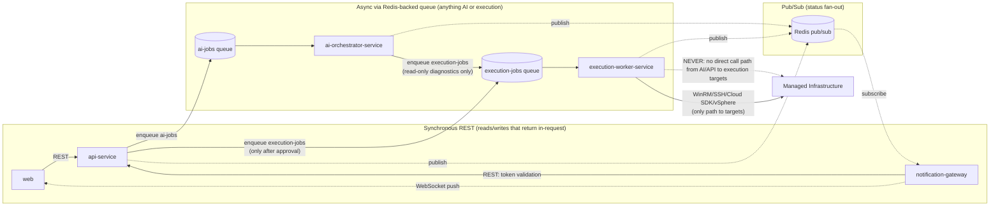

# Microservice Breakdown and Service Boundaries

## 1. Guiding Decision: Modular Monolith, Not 20 Microservices

AI Infrastructure Copilot has 20 product modules and 15 AI agents. Naively, each could become its own microservice, but that would mean 20+ deployables sharing one PostgreSQL schema, 20+ sets of CI/CD pipelines, and 20+ places to apply RBAC consistently, most of which would be net-idle services making chatty synchronous calls to each other for basic CRUD (an Alert Center query that needs `Servers` data, a Script Library entry that needs `AuditLogs`, and so on). That complexity buys nothing at this stage: the modules share one data model, one auth boundary, and are built and released by one team.

Instead, the 20 modules are implemented as **routers within a single FastAPI codebase** (`apps/api`, the `api-service`), each in its own `modules/<name>/` package with its own router, schemas, and service layer (see `docs/11-folder-structure.md`, Section 4). This gives module-level code isolation and independent testability without the operational overhead of independent deployment. If a specific module later proves to need independent scaling (for example, Windows Event Log Analyzer under heavy log ingestion), it can be extracted from the monolith later because the module boundary already exists in code.

What does **not** follow the modular-monolith rule is anything that (a) needs a different trust boundary than the rest of the API, or (b) has a fundamentally different scaling/latency shape than request/response CRUD. Four services are split out from day one for those reasons.

## 2. Day-One Services

| Service | Role | Why it's separate |
|---|---|---|
| `api-service` | FastAPI, stateless. Auth/RBAC, CRUD for all 20 modules, orchestrates job enqueue, serves REST to `web` | Baseline stateless service; separated from the other three below because it is internet-facing (behind the gateway) and must never hold infrastructure credentials |
| `execution-worker-service` | Isolated. Holds WinRM/SSH credentials (resolved from vault at call time). The only service that ever opens a connection to target infrastructure (WinRM, SSH, cloud SDK calls, vSphere/Hyper-V APIs). Receives jobs via the Redis-backed queue, never via direct inbound API call | **Blast-radius containment.** If `api-service` is compromised (a dependency CVE, an injection bug, a leaked pod), the attacker gets a database connection and business logic, not credentials to every managed Windows/Linux server, cloud account, and hypervisor. By construction, `execution-worker-service` has no public ingress, no route from the API gateway, and a restrictive Kubernetes `NetworkPolicy` limiting egress to the queue, the vault, and the managed-infrastructure network segments. Compromising it requires first compromising something already inside that isolated boundary |
| `ai-orchestrator-service` | Runs LangGraph graphs (Planner → Agent Selection → Tool Calling → Data Collection → Reasoning → RCA → Recommendation → Script Generation). Can run long (multi-minute) jobs, may hold GPU nodes for local LLM inference. Calls `execution-worker-service` only by publishing to the same job queue, never directly | **Different scaling and latency shape than CRUD**, and a second layer of blast-radius containment: even if an AI agent is manipulated (prompt injection from a malicious log line, a jailbroken tool call) into deciding to run something destructive, it still cannot execute anything itself. It can only place a job on the `execution-jobs` queue tagged `PENDING_APPROVAL`, and `execution-worker-service` refuses to run any mutating job that is not `APPROVED` by a human, recorded in `AuditLogs`. Read-only diagnostic jobs are the only ones this service (or `api-service`) can place directly onto `execution-jobs` without a prior approval step |
| `notification-gateway` | Socket.IO service, isolated for connection-handling reasons | Long-lived WebSocket connections have different pod lifecycle, memory, and scaling characteristics (connection count, not request rate) than stateless REST pods; keeping it separate means deploying a new `api-service` version never drops active WebSocket sessions, and vice versa |

## 3. Why Exactly These Four (and Not More, Not Fewer)

- **Not fewer:** collapsing `execution-worker-service` into `api-service` would mean the internet-facing, most-frequently-deployed, largest-surface-area service also holds live WinRM/SSH credentials, which is the single biggest security risk in the system. Collapsing `ai-orchestrator-service` into `api-service` would mean a slow LLM call or a stuck LangGraph run consumes request-handling capacity meant for ordinary CRUD traffic, and would let AI logic execute infrastructure changes directly if a future engineer takes a shortcut, undermining the approval gate.
- **Not more:** splitting each of the 15 AI agents into its own service, or each connector (WinRM/SSH/Azure/AWS/GCP/VMware/Hyper-V) in `execution-worker` into its own service, adds deployment and network overhead without a corresponding security or scaling benefit; agents and connectors are library code invoked in-process by their respective orchestrator/worker, not separately-trusted principals. They are modularized in code (see `docs/11-folder-structure.md` Sections 5 to 6) rather than in deployment.

## 4. Inter-Service Communication

Two communication patterns are used, chosen per interaction based on whether the caller needs an immediate answer or is kicking off work that may take seconds to minutes:

### 4.1 Redis-backed job queue (async, for anything that touches AI or target infrastructure)

- **`ai-jobs` queue:** `api-service` → `ai-orchestrator-service`. Producer enqueues on user prompt submission (AI Chat, or any module's AI-assisted diagnosis trigger) and returns `202 Accepted` with a `task_id` immediately; the caller does not block on LLM latency.
- **`execution-jobs` queue:** `api-service` (after human approval) or `ai-orchestrator-service` (for pre-approved read-only diagnostics only) → `execution-worker-service`. `ai-orchestrator-service` never calls `execution-worker-service` directly (no REST endpoint is exposed for this); it can only place a job on the queue, and that job is inert until `execution-worker-service`'s `approval_guard` confirms the associated `Tasks` row is `APPROVED` (or the job is explicitly flagged read-only).
- **Progress/event pub/sub:** all three backend services (`api-service`, `ai-orchestrator-service`, `execution-worker-service`) publish status events (`task.progress`, `task.completed`, `alert.created`, `approval.requested`) to Redis pub/sub channels; `notification-gateway` subscribes and fans them out to browsers over Socket.IO. This is also async and one-directional (publish-and-forget); no service waits on `notification-gateway`.
- Queue technology: Celery or Arq on top of Redis Streams/Lists, chosen at build time; either satisfies at-least-once delivery, retry/backoff, and dead-letter queues as described in `docs/02-HLD.md` Section 9.

### 4.2 Direct REST (sync, for reads that must return in the same request)

- `web` → `api-service`: all user-facing reads/writes (dashboard data, inventory listings, RBAC-gated CRUD) go through synchronous REST because the UI needs an immediate response.
- `notification-gateway` → `api-service`: token validation on WebSocket connect (a fast, synchronous lookup) is the one place `notification-gateway` calls `api-service` directly over REST; everything else it does is queue/pub-sub driven.
- No REST endpoint exists from `api-service` or `ai-orchestrator-service` into `execution-worker-service`, and none exists from `ai-orchestrator-service` into `api-service`'s write paths for infrastructure mutation, by design (see Section 5). `ai-orchestrator-service` does call `api-service`-owned PostgreSQL directly for reading context and writing `AIConversations`/`AIMessages`, and reads `pgvector` directly for RAG, since those are data-tier calls, not service-to-service execution calls.

## 5. Why the Execution Worker Is Intentionally Isolated

This is the single most important boundary in the system and deserves restating plainly:

- **Principle:** a compromised `api-service` pod, or a manipulated `ai-orchestrator-service` agent, must never be able to directly open a WinRM or SSH session, call a cloud provider's mutating API, or touch a hypervisor. The only component in the entire platform with the network reachability and credential access to do that is `execution-worker-service`.
- **Mechanism, not just policy:**
  - **Network isolation:** `execution-worker-service` runs in its own Kubernetes node pool with a `NetworkPolicy` that permits egress only to (a) the Redis queue, (b) the secrets vault, and (c) the specific managed-infrastructure network segments (via VPN/peering per customer). No other pod in the cluster shares this egress profile, and `execution-worker-service` has no ingress route from the API gateway; it cannot be reached from outside the cluster at all.
  - **Credential isolation:** `Credentials` records stored in PostgreSQL are vaulted references; the secret material only ever gets resolved inside `execution-worker-service`'s `vault/credential_resolver.py`, immediately before use, and is never logged, never returned in an API response, and never passed to `ai-orchestrator-service` or `api-service` in cleartext.
  - **Approval isolation:** `execution-worker-service`'s `approval_guard` is the last line of defense; it independently re-checks the `Tasks`/`AutomationJobs` row's status against PostgreSQL before running anything mutating, rather than trusting the job payload's claimed approval state. This means even if a bug elsewhere enqueues an unapproved mutating job, the worker itself refuses it.
  - **No direct call path:** because `ai-orchestrator-service` can only reach `execution-worker-service` through the shared job queue, there is no RPC/REST endpoint on `execution-worker-service` for another service to call. An attacker who fully compromises `ai-orchestrator-service` can at most enqueue jobs, all of which still pass through the approval gate for mutating actions.
- **Consequence for blast radius:** the worst case for a compromised `api-service` or `ai-orchestrator-service` pod is data exposure/tampering within the application database and unauthorized job enqueueing, not unauthorized changes to a customer's Active Directory, file servers, cloud accounts, or virtualization hosts. Containing the blast radius to the data tier, where standard database security controls, backups, and audit logging already apply, is a materially better security posture than allowing infrastructure-credential access from a general-purpose, internet-adjacent, frequently-deployed service.

## 6. Evolution Path

As the platform scales, natural next extractions from the `api-service` modular monolith (in likely priority order, not committed for v1) are:
1. **Windows Event Log Analyzer** and **Performance Analyzer**, if log/metric ingestion volume grows large enough to need independent scaling from the rest of the CRUD API.
2. **Reporting** (scheduled `Reports` generation), if report generation becomes CPU/IO-heavy enough to affect API latency.
3. Splitting `execution-worker-service` itself per target type (a `windows-execution-worker`, `linux-execution-worker`, `cloud-execution-worker`, `virt-execution-worker`) if per-target-type scaling or per-target-type network isolation (e.g. different customer network segments) becomes necessary; the connector-per-module structure in `apps/execution-worker/app/connectors/` (see `docs/11-folder-structure.md` Section 6) is already organized to make this split mechanical rather than a rewrite.

None of these are required for the initial build; they are documented here so the module boundaries chosen today do not have to be redrawn later.
